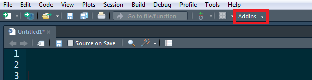
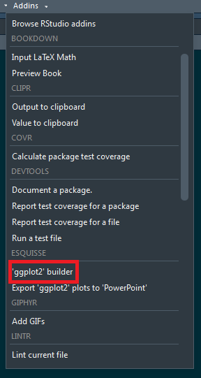
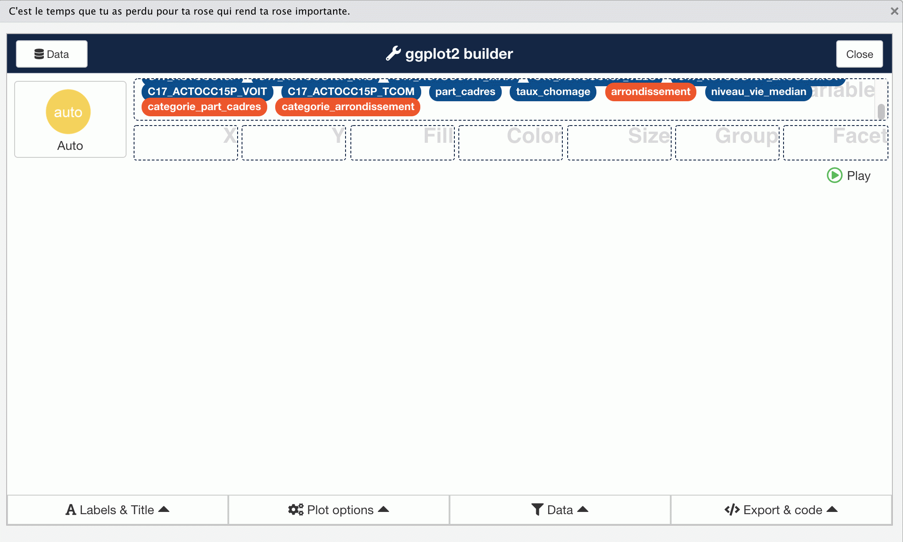
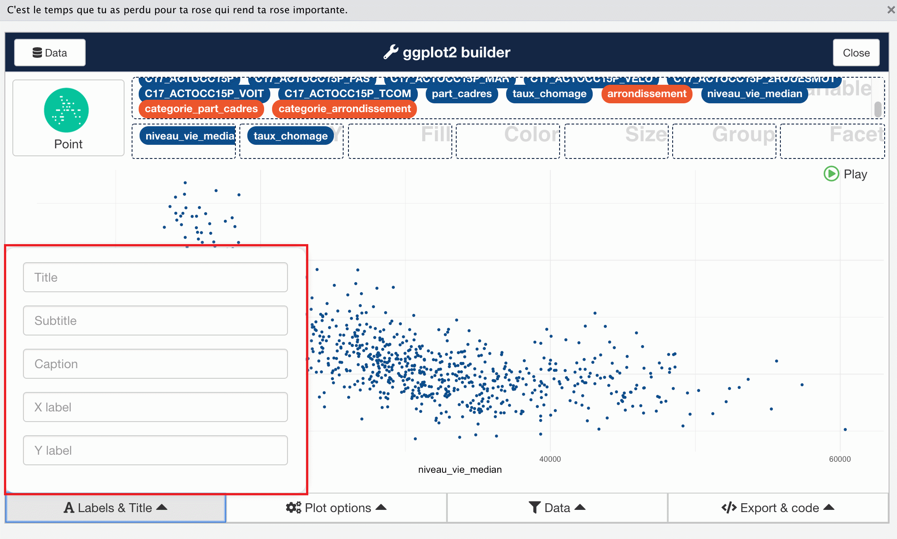

# Atelier réaliser des graphiques
## Objectif de cet atelier

```{r setup, include=FALSE}
options(htmltools.dir.version = FALSE)
knitr::opts_chunk$set(eval = params$eval)
```


.sauterligne2[
Cet atelier vise à montrer comment on peut utiliser de la documentation `utilitR` pour réaliser des graphiques avec `R`.
]


.sauterligne3[
.small90[
.remarque[
  Cette présentation n'aborde que les principaux éléments. Vous pouvez vous référer à la [documentation elle-même](https://www.utilitr.org/) pour des informations détaillées !
  
]
]
]

---
# Atelier réaliser des graphiques
## Méthode

- Je vais vous présenter les outils `esquisse` et `ggplot2`, sur le plan théorique et avec des exemples.
- Je vais exécuter des exemples dans un service RStudio sur le SSP Cloud.

--

.sauterligne[Deux façons de suivre cet atelier :]

- Vous pouvez vous contenter d'assister à la présentation ;
- Vous pouvez reproduire les exemples en même temps que moi en lançant votre propre service RStudio sur le SSP Cloud => __aucune obligation__.

.sauterligne[
Le lien vers le service RStudio du SSP Cloud est disponible sur cette page : https://www.utilitr.org/conferences/decouverte-utilitr/  
]

--

.remarque[
Vous pourrez reproduire les exemples plus tard.
]

---
# Réaliser des graphiques avec `R`

.sauterligne2[
.recommandation[
* Il est recommandé d'utiliser le *package* `ggplot2` qui permet de réaliser et de personnaliser un grand nombre de représentations graphiques ;
* Il est conseillé aux utilisateurs débutants d'utiliser l'*add-in* `esquisse` pour se familiariser avec `ggplot2`.
]
]

--

.sauterligne2[
Plan de la présensation :
]

- utiliser l'_add-in_ `equisse` pour se familiariser avec `ggplot2` ;
- utiliser directement `ggplot2`.

---
# Découvrir `ggplot2` avec `esquisse`

Le _package_ `esquisse` propose une interface graphique qui facilite la construction de graphiques avec `ggplot2`. L'objectif de ce *package* est de vous aider à construire rapidement un code `ggplot2` pour faire le graphique que vous voulez.

--

.small80[
.remarque[
**L'utilisation d'`esquisse` ne remplace pas l'écriture d'un code `ggplot2`, et cet _add-in_ ne doit pas être utilisé pour réaliser et exporter un graphique sans sauvegarder le code qui le produit** (sinon vous ne pourrez ni reproduire ni modifier votre graphique par la suite).
]
]

--

.small80[
.conseil[
L'interface graphique d'`esquisse` est assez gourmande en ressources, il est donc déconseillé de l'utiliser avec des données volumineuses (plus de 100 000 observations). Si vous êtes dans cette situation, **il est fortement conseillé d'utiliser `esquisse` sur une petite partie de vos données** (les 1 000 ou 10 000 premières lignes par exemple).
]
]

---
# Découvrir `ggplot2` avec `esquisse`

Cette section illustre l'utilisation d'`esquisse` avec la table `data_iris_paris_2017` du _package_ `doremifasolData`, qui contient des données économiques et sociales sur les iris de la ville de Paris en 2017. Il faut donc charger ces données dans `R` :

.sauterligne2[
```{r, message = FALSE}
library(doremifasolData)
data_iris_paris2017 <- doremifasolData::data_iris_paris_2017
```
]


---
# Découvrir `ggplot2` avec `esquisse`

.sauterligne2[
Vous pouvez accéder à cet _add-in_ en cliquant sur *'ggplot2' builder* dans le menu _Addins_ de  RStudio.
]

```{r, echo = FALSE, out.width= "50%", out.extra= 'style = "position: absolute; top: 5cm; left: 2cm; padding: 0;"'}

```

```{r, echo = FALSE, out.width= "25%", out.extra= 'style = "position: absolute; top: 5cm; left: 15cm; padding: 0;"'}

```

---
# Découvrir `ggplot2` avec `esquisse`


Dans la première boîte de dialogue, vous devez sélectionner le `data.frame` qui contient les données que vous voulez représenter sur le graphique. Vous pouvez éventuellement sélectionner certaines variables, et modifier le type de certaines variables.

```{r, echo = FALSE, out.width= "75%"}
knitr::include_graphics("./resources/intro_graphiques/choix_dataframe.png")
```

---
# Découvrir `ggplot2` avec `esquisse`

Une nouvelle boîte de dialoque s'affiche, grâce à laquelle vous pouvez contruire un graphique. Les variables présentes dans vos données sont listées en haut.

```{r, echo = FALSE, out.width= "95%"}

```

---
# Découvrir `ggplot2` avec `esquisse`

Vous pouvez déplacer les variables dans les différentes catégories (dans le cadre vert) : `x` pour les abscisses, `y` pour les ordonnées, `color` et `size` pour la couleur et la taille des éléments graphiques...

```{r, echo = FALSE, out.width= "95%"}
knitr::include_graphics("./resources/intro_graphiques/esquisse_champs.png")
```

---
# Découvrir `ggplot2` avec `esquisse`

Il est possible de modifier l'apparence du graphique (titres des axes, légende...) avec les menus en bas.

```{r, echo = FALSE, out.width= "95%"}

```

---
# Apprendre les bases de `ggplot2`


---
background-image: url('resources/logo-utilitr.png')
background-size: 7cm
background-position: 8.5cm 3cm

# Merci !
