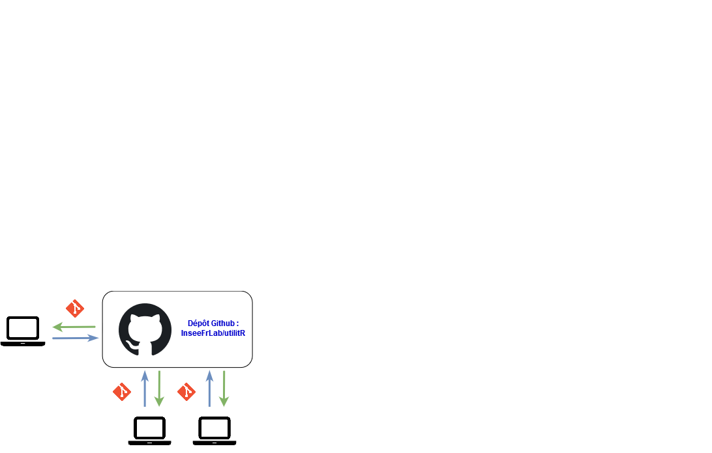
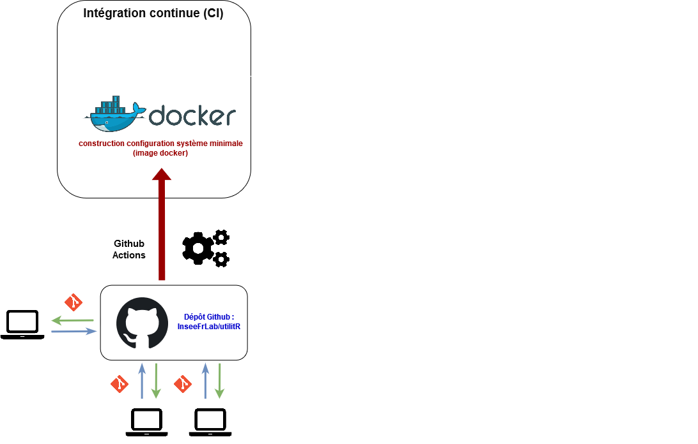
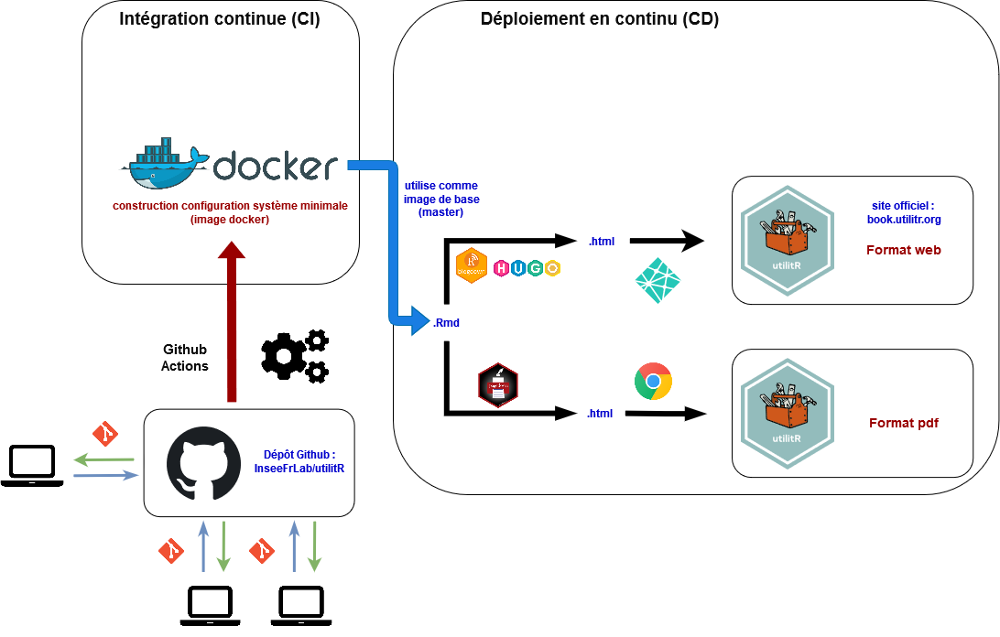
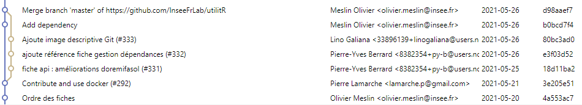

# Introduction

```{r setup, include=FALSE}
options(htmltools.dir.version = FALSE)
```

.sauterligne3[
`utilitR` projets aims to propose a collaborative documentation on the `R` ecosystem (R, RStudio, Git, Gitlab).
]

.sauterligne2[
This documentation is:

- a practical guide, not a course on `R` ;
- mostly written by French civil servants but interest audience goes beyond ;
- based on a collaborative approach (not a top-down philosophy).
]


```{r, echo = FALSE, warning = FALSE, eval = FALSE}
library(knitr)
library(kableExtra)
library(data.table)
description_appariement <- 
  as.data.table(
    data.frame(
      etape = c(
        rep('Utiliser `R` à l’Insee', 5),
        rep("Mener un projet statistique avec `R`", 5),
        rep("Importer des données", 3),
        rep("Manipuler des données", 3),
        rep("Produire des _outputs_", 3)
        ),
      filtres_validation = 
        c(
          "Les environnements de travail avec `R` à l'Insee : AUSv3 et SSP Cloud", 
          "Les environnements de travail avec `R` à l'Insee : AUSv3 et SSP Cloud", 
          "Configurer Git et Gitlab",
          "Personnaliser la configuration de `R`",
          "Gérer les ressources informatiques avec `R`",
          "Utiliser les projets RStudio",
          "Utiliser Git avec RStudio",
          "Installer des packages et gérer les dépendances",
          "Choisir des packages",
          "Demander de l'aide et se documenter",
          "Importer des données (SAS, csv, txt, odt, xlsx...)",
          "Utiliser une API",
          "Utiliser des bases de données",
          "Manipuler des données avec `data.table`",
    # + Manipuler des données (table des données, données textuelles, données spatiales) ;
    # + Utiliser des bases de données PostgreSQL et Oracle ;
    # + Faire des graphiques ;
    # + Rédiger des documents avec `R Markdown` ;
    # + Produire des rapports automatisés avec `R Markdown`.
          "BBB",
          "AAA",
          "BBB",
          "AAA",
          "BBB"
        )
    )
  )

kbl(description_appariement, align = "cll",
    col.names = c("Partie", 
                  "Fiches")
) %>%
  kable_styling(full_width = TRUE) %>%
  row_spec(0, align = 'c') %>%
  column_spec(1, bold = TRUE, width = "6cm") %>%
  column_spec(2, width = "12cm") %>% 
  collapse_rows(columns = 1, 
                valign = "middle", 
                longtable_clean_cut = TRUE)
```

---
# Introduction

.sauterligne2[
`utilitR` is a practical guide that aims to answer the following questions in a work environment that corresponds to organizations that adopted `R` as the main tools for statistical analysis  :  
]

- How to benefit from the exceptional ecosystem provided by `R` and `RStudio` ? 
- How to be efficient in `R` with standard statistical tasks ?

--

.sauterligne2[
Project history :
]

* End 2019 : started to talk about it ;
* Mars 2020 : launch `r emo::ji("rocket")`;
* Mai 2021 : first release ;
* 8-9 juin 2021 : communication (inside and outside Insee) ;

.gray[
* 2022 : starting to work with OECD on good practices ?
]


---
# Introduction

.sauterligne2[
`utilitR` started from two standpoints : 
]

1. **People moving to `R` from `SAS` or `Excel` face obstacles** :
    + Many _packages_ help doing the same task with heterogeneous quality ;
    + Some people have difficulties with English speaking documentation ;
    + People inside large organizations can use `R` for very different reasons and might be tempted not to follow the same practice ;
    
--

2. **There is no reference documentation oriented to official statistical users** :
    + Lots of documentation on `R`...
    + ... But not that much based on real datasets that are close to what people do every day (data cleaning, engineering...)


---
# Introduction

.sauterligne[
Plan de la présentation :
]

- Introducing `utilitR` ;
- Why is `utilitR` special ;
- Project organization.

---
# Introducing `utilitR`
## Where and how to find `utilitR` ?

Three main output :

- `r fontawesome::fa("fab fa-firefox")` Website ([www.utilitr.org](https://www.utilitr.org)) ;
    + Main documentation [www.book.utilitr.org](www.book.utilitr.org) ;
    + Guide of good practice [www.pratiques.utilitr.org](www.pratiques.utilitr.org) (should be updated) ;
- `r fontawesome::fa("fas fa-print")` each chapter available can be saved as A4 page PDF ;
- `r fontawesome::fa("fas fa-file-pdf")` whole documentation (350+ pages) can be downloaded. 

--

<br> **Please talk to `utilitR` to every potential `R` users !**


---
# Why is `utilitR` special ?


- Everything is collaborative and _open source_ ;
- Everything is reproducible ;
- Everything is adapted to statistician needs.


---
# Why is `utilitR` special ?
## Everything is collaborative and _open source_ (1/3)

* _Open source_ from day 1 (`r fontawesome::fa("fab fa-github")` [`InseeFrLab`](https://github.com/InseeFrLab/utilitR)) ;
* Around 30 contributors :
    + not all from Paris ;
    + not all from Insee.
* Horizontal organization (`Wikipedia` model) :
    + peer reviewed ;
    + community approval ;
* Help discover tools for *reproducibility* beyond `r fontawesome::fa("fab fa-r-project")` :
    + `Docker` `r fontawesome::fa("fab fa-docker")` ;
    + `Git` `r fontawesome::fa("fab fa-git-alt")` ;
    + `Github` `r fontawesome::fa("fab fa-github")`.

**You are welcome to contribute to `utilitR` (sorry in French `r emo::ji("france")` `r emo::ji("baguette")`)**

---
# Why is `utilitR` special ?
## Everything is reproducible

* Everything built with `R Markdown` ;
* State of the art tools :
    + Several _output_ (site web `r fontawesome::fa("fab fa-firefox")`, livre PDF `r fontawesome::fa("fas fa-file-pdf")`) with the same source code ;
    + Automatic publication when changing text or examples ;
    + Everything is reproducible.

---
# Why is `utilitR` special ?
## Everything is adapted to statistician needs.

A practical guide for `R` users written by `R` users :

- Recommandations or advices regarding packages or how to solve a given problem ; 
- Based on _open data_ that are heavily used by academics, journalists, etc.

--

4 types of isolated information to emphasize some point or give extra details:

.sauterligne[
.small80[
```{r echo = FALSE, message = FALSE, warning = FALSE}
library(magrittr)
library(fontawesome)
texte_recommandation <- "Ce paragraphe présente succinctement les outils et les approches les plus adaptés à la tâche concernée. Chaque fiche ne comprend qu'un seul paragraphe de ce type, au début de la fiche."
texte_conseil        <- "Ce paragraphe détaille les bonnes pratiques à adopter."
texte_remarque       <- "Ce paragraphe donne des informations supplémentaires ou formule une mise en garde."
texte_specificite    <- "Ce paragraphe porte sur une spécificité de l'Insee qui a un impact sur l'usage de <code>R</code>."

symb <-
  c(fa("hand-point-right", fill = "rgba(220, 53, 69, 1)", height = "30px"),
    fa("lightbulb", fill = "rgba(255, 193, 7, 1)", height = "30px"),
    fa("info-circle", fill = "rgba(0, 123, 255, 1)", height = "30px"),
    fa("home", fill = "rgba(81, 81, 81, 1)", height = "30px"))

dt <- 
  as.data.frame(list(
    Nom = c("Recommandation", 
            "Conseil", 
            "Remarque",
            "Spécificité Insee"), 
    Symbole = symb,
    Signification = c(texte_recommandation, 
                      texte_conseil, 
                      texte_remarque,
                      texte_specificite)
  )
  )


output <- 
  dt %>% 
  knitr::kable(escape = F, position = "center", full_width = F, align="ccl") %>%
  kableExtra::column_spec(1, width = "3cm", bold = TRUE) %>%
  kableExtra::column_spec(2, width = "2cm") %>% 
  kableExtra::column_spec(3, width = "12cm") %>% 
  kableExtra::row_spec(0,bold=TRUE, align = "c")
output
```
]
]

---
# Fonctionnement du projet
## Organisation du projet

**Le projet `utilitR` est un projet collaboratif, horizontal, _open source_ et ouvert à tous, auquel tous les agents peuvent contribuer.**

--
* Cinq principes détaillés dans le [manifeste](https://github.com/InseeFrLab/utilitR/blob/master/Manifeste.md) : transparence, ouverture, bienveillance, exigence et reproductibilité.

--

* Organisation sans hiérarchie :
    * Un _groupe de contributeurs_ `r emo::ji("black_nib")` (environ 25), parmi lesquels deux coordinateurs ;
    * Un _comité de parrainage_ composé de managers  `r emo::ji("angel")`: Benoît Rouppert, Arnaud Degorre, Patrick Sillard, Sébastien Roux.
--

* Les travaux sont menés selon les méthodes de développement logiciel (_pull requests_, _issues_) ;
--

* La marche à suivre pour contribuer est détaillée dans le [guide de contribution](https://github.com/InseeFrLab/utilitR/blob/master/CONTRIBUTING.md).

--
<br><br>
**Vous pouvez rejoindre l'équipe de contributeurs à tout moment.**

---
# Fonctionnement du projet
## Les 5 principes du projet `utilitR`


* __Transparence__ : l'ensemble du projet est librement accessible sur le dépôt Github, sous licence libre ;
* __Ouverture__ : toute personne qui le souhaite peut rejoindre le projet à tout moment. Les modalités de contribution peuvent prendre différentes formes, détaillées dans le guide des contributeurs ;
* __Bienveillance__ : toutes les idées, initiatives et propositions sont les bienvenues, et les contributeurs veillent à se soutenir les uns les autres ;
* __Exigence__ : les modifications de la documentation sont systématiquement soumises à une revue par les contributeurs du projet et ne sont acceptées que lorsqu'elles rencontrent une large approbation ;
* __Reproductibilité__ : les exemples développés dans la documentation doivent être reproductibles.

Ces principes sont exposées dans un
[Manifeste](https://github.com/InseeFrLab/utilitR/blob/master/Manifeste.md)
exposant la philosophie du projet

---
# Fonctionnement du projet
## L'architecture du projet

* Les contributeurs collaborent par l'intermédiaire du dépôt `Github` du projet
[https://www.github.com/inseefrlab/utilitr](https://www.github.com/inseefrlab/utilitr).

```{r, echo = FALSE, out.width="85%", fig.align="center"}

```

---
# Fonctionnement du projet
## L'architecture du projet

* Des scripts automatiques créent l'environnement informatique de production de la documentation et vérifient que les codes sources ne contiennent pas de bug.


```{r, echo = FALSE, out.width="85%", fig.align="center"}

```

---
# Fonctionnement du projet
## L'architecture du projet

* La documentation est déployée automatiquement en plusieurs formats ;
* Mais il est nécessaire de tester les évolutions avant leur déploiement.

```{r, echo = FALSE, out.width="85%", fig.align="center"}

```


---
# Fonctionnement du projet
## L'architecture du projet

* Chaque contribution est déployée sur un site temporaire pour vérification ;
* Seule la version validée sera sur [www.book.utilitr.org](https://www.book.utilitr.org).

```{r, echo = FALSE, out.width="85%", fig.align="center"}
knitr::include_graphics("./resources/graphCI/githubCI_complete.png")
```

---
# Fonctionnement du projet
## Une approche au service de la reproductibilité et de la qualité

C'est le dépôt [`Github` `r fontawesome::fa("fab fa-github")` d'`utilitR`](https://github.com/InseeFrLab/utilitR) qui centralise tout le fonctionnement du projet. Il propose :

* Un __environnement informatique complet et reproductible__ pour produire la documentation (image `Docker` `r fontawesome::fa("fab fa-docker")`) ;

--

* Des scripts d' __intégration continue__ `r fontawesome::fa("fas fa-cogs")` qui vérifient que les contributions ne comportent pas d'erreur de programmation, et que les exemples sont bien reproductibles ;

--

* Des scripts de __déploiement continu__ qui compilent la documentation et déploient le site internet à chaque modification de la branche `master` ;

--

* Un **site de prévisualisation** `r fontawesome::fa("fab fa-firefox")` (via `Netlify`) sur lequel les contributeurs peuvent voir les modifications qu'ils apportent au site, sans que le site public ne soit modifié.

[](https://hub.docker.com/repository/docker/inseefrlab/utilitr/general)
[](https://github.com/InseeFrLab/utilitR/actions)


---
# Fonctionnement du projet
## Collaborer avec Github

* __Plusieurs modalités de contribution__ proposées pour offrir légèreté, flexibilité et simplicité ;

--

* Les contributions les plus simples sont possibles _via_ une interface graphique ;

--

    * Le bouton *Edit this page* `r fontawesome::fa("fab fa-github")` sur [www.book.utilitr.org](https://www.book.utilitr.org) permet d'utiliser l'interface visuelle `Github` pour proposer une modification d'une fiche (*pull request* automatiquement créée).

    * Les _issues_ sont des fils de discussion qui permettent des débats et échanges sur tous les sujets :
      + signaler un *bug*, 
      + proposer une nouvelle fiche, 
      + proposer un nouvel exemple, 
      + participer à un débat sur un *package*...

---
# Fonctionnement du projet
## Collaborer avec Github

* Pour ajouter des éléments plus substantiels (nouvelles 
fiches, ajout de paragraphe, évolution de la tuyauterie...), il est possible d'ouvrir des *pull requests*.
* Les contributeurs s'entraident pour acquérir la maîtrise des outils.

--

.sauterligne2[
Deux points à retenir :
]

- __Il n'est pas nécessaire de bien connaître Git et Github pour contribuer au projet ;__
- __Contribuer au projet permet de se familiariser avec les méthodes de l'_open source_ qui renforcent la fiabilité des projets.__

---
# Fonctionnement du projet
## Collaborer avec Github

* On a choisi le mode de travail le plus léger (*Github Flow*) ;
* Cependant, les seuls personnes ayant droit d'écriture sur
[InseeFrLab/utilitR](https://github.com/InseeFrLab/utilitR) sont les coordinateurs (mainteneurs) ;
* Les contributeurs travaillent sur des copies du dépôt principal (`forks`) et soumettent les changements à partir de ces copies ;
* Lorsqu'une modification proposée par un contributeur est validée par les autres contributeurs, elle est intégrée au dépôt principal par les coordinateurs.

```{r, echo = FALSE}

```

<br> __Ce mode de travail est exportable à un environnement interne `Gitlab` `r fontawesome::fa("fab fa-gitlab")`__

---
# Fonctionnement du projet
## Avantages de l'intégration continue

Chaque action sur `Github` déclenche des scripts pour construire, tester et déployer la mise à jour de la documentation:

+ **allège le travail** des coordinateurs et des contributeurs ;
+ assure un **environnement plus reproductible** ;
+ assure la **cohérence entre les différents formats** ;
+ **facilite le repérage des erreurs** ;
+ permet aux contributeurs d'ignorer les détails techniques de la production de la documentation et de **se concentrer uniquement sur le fond**.

```{r, echo = FALSE, out.width="50%", fig.show="hold", fig.align='center'}
knitr::include_graphics("https://flexagon.com/wp-content/uploads/2020/04/a-world-without-ci.cd-meme.jpg")
```

---
# Fonctionnement du projet
## `R Markdown`, *un langage pour les gouverner tous*

<!-- en un site web ou un PDF cohérent (gestion des numéros de chapitre, des -->
<!-- liens entre fiches, etc.) -->

<!-- (`.Rmd` ➜ `.md` ➜ `.html`) ; -->
<!-- (`.md` ➜ `.html` ➜ `.pdf`) ; -->

* Les codes sources de la documentation prennent la forme de fichiers `R Markdown`, qui rassemblent les textes et les exemples de codes ;
* `R` compile ces codes sources de deux manières :
    + Production d'un site internet grâce au _package_ `blogdown` ;
    + Production d'un livre en format A4 grâce au _package_ `pagedown` ;
    + De plus, l'utilisation de `paged.js` permet de transformer chaque page du site internet en un chapitre paginé prêt à être imprimé.
    
--

* Les modèles de document reposent sur les technologies Web standards (CSS et Javascript) et sont organisés sous la forme d'un _package_.

--

<br>
Utiliser les outils les plus appropriés pour réaliser une tâche donnée (compilation en site web, en PDF...).


<!-- --- -->
<!-- # Où en est le projet aujourd'hui ? -->

<!-- * Un portail d'accès sous forme de site *web* : -->
<!--     + La documentation principale est disponible sur [www.book.utilitr.org](www.book.utilitr.org) ; -->
<!--     + Guide des bonnes pratiques en `R` disponible sur [www.pratiques.utilitr.org](www.pratiques.utilitr.org). -->

<!-- -- -->

<!-- * Prochaines étapes : -->
<!--     + Mai 2021 : finalisation des contenus ; -->
<!--     + 8-9 juin 2021 : lancement officiel d'`utilitR` ; -->
<!--     + Septembre 2021 : diffusion de la version 1 de la brochure pdf. -->

---
# Remerciements

<!-- Le projet `utilitR` est un projet collaboratif qui a bénéficié des contributions de :  -->
<!-- r paste0(paste(format(Filter(function(x) !("cph" %in% x$role), desc::desc_get_authors()), include = c("given", "family")), collapse = ", "), ".") -->

.small90[
.auteurs[

Contributeurs : Raphaële Adjerad, Mathias André, Pierre-Yves Berrard, Lionel Cacheux, Arthur Cazaubiel, Frédérique Cornuau, Sylvain Daubrée, Aurélien d'Isanto, Arlindo Dos Santos, Alexis Eidelman, Marie-Emmanuelle Faure, Gilles Fidani, Lino Galiana, Gaëlle Genin, Pierre Lamarche, Claire Legroux, Romain Lesur, Jean-Daniel Lomenède, Pascal Mercier, Olivier Meslin, Violaine Poirot, Géraldine Rochambeau, Clément Rousset, Milena Suarez Castillo, Cédric Tassart.

Coordination : Lino Galiana et Olivier Meslin.

Comité de parrainage : Arnaud Degorre, Benoît Rouppert, Patrick Sillard et Sébastien Roux.

Logo : Anna Schlaifer.

Les contributeurs remercient Julien Taquet et Marc Hufschmitt pour leur aide précieuse sur la mise en forme du site et de la brochure.
]
]

---
background-image: url('resources/logo-utilitr.png')
background-size: 7cm
background-position: 8.5cm 3cm

# Merci !


