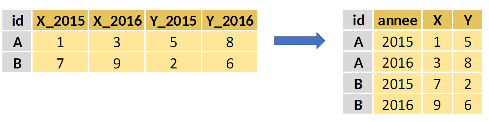
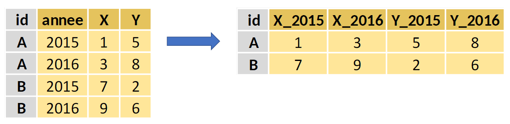

# Organisation générale

```{r setup, include=FALSE}
options(htmltools.dir.version = FALSE)
library(dplyr)

```

.sauterligne2[
Le contenu de cette présentation sera : 

* _semi_-applicatif : je vais alterner entre considérations générales (sur ce document), et lancer du code `R` via la plateforme datalab.
* _semi_-participatif : ceux qui le souhaitent peuvent réaliser des tests sur la documentation en parallèle de mon intervention, ou lancer *n'importe quelle partie de la documentation* !
]

--

Comment utiliser `utilitR` ?

- [Le Chapitre 1](https://www.book.utilitr.org/presentation-utilitr.html#presentation-utilitr) de la documentation explicite comment l'utiliser ;
- Les chapitres 2 à 5 donnent des informations additionnelles intéressantes spécifiques à l'Insee, notamment sur le SSP Cloud.
- Les chapitres suivants traitent de **besoins concrets** et proposent des manières de procéder.

.sauterligne2[
  Je vais spécifiquement parler du [{tidyverse}](https://www.book.utilitr.org/tidyverse.html)]

---
# Quand faire du tidyverse ?

.recommandation[
* Pour des tables de données de taille petite et moyenne (inférieure à 1 Go ou moins d'un million d'observations), il est recommandé d'utiliser les _packages_ {dplyr} et {tidyr} qui font l'objet de la présente fiche ;
* Pour des tables de données de grande taille (plus de 1 Go ou plus d'un million d'observations), il est recommandé d'utiliser le _package_ {data.table} qui fait l'objet d'une fiche (et d'un atelier) !
]

--
Ici, je travaillerai sur l'exemple de la bpe :


```{r, echo = TRUE, warning = FALSE, eval = FALSE}
library(doremifasolData) #un package pour travailler sur des exemples
bpe_ens_2018 <- doremifasolData::bpe_ens_2018
```

---
# Tidyverse, kesako ?

Le {tidyverse} est un ensemble de _packages_ `R` qui présentent un cadre de codage "homogène" et de nombreux avantages : 
* La syntaxe est structurée autour de verbes, ce qui la rend très lisible ;
* Les opérations par groupe sont facilitées par l'instruction `group_by()` ;
* Les noms des colonnes peuvent être appelés directement;
* L'opérateur `%>%` (pipe) qui permet d'enchaîner les instructions ;

Dans cette présentation, j'aborderai deux _packages_ :{dplyr}et {tidyr}.

```{r, echo = TRUE, warning = FALSE, eval = FALSE}
library(dplyr)
bpe_ens_2018 %>%
  filter(REG=="32") %>%
  group_by(DEP) %>%
  summarize(sum_nb_equip=sum(NB_EQUIP)) %>%
  arrange(desc(sum_nb_equip))
```


---
# Comprendre `%>%`

Le _pipe_ `%>%`est un opérateur permettant d'enchainer élégamment des opérations :
* le terme qui précède `%>%` est utilisé comme premier argument de ce qui suit ;
* les opérations peuvent être enchaînées en enchaînant les opérateurs pipe.


Par exemple : 

```{r, echo = TRUE, warning = FALSE, eval = FALSE}
mean(c(1,3,pi,10,-50))

c(1,3,pi,10,-50) %>% mean()
```
--

Mais encore : 
```{r, echo = TRUE, warning = FALSE, eval = FALSE}
round(abs(mean(c(1,3,pi,10,-50))),digits=4)

c(1,3,pi,10,-50) %>%
  mean() %>%
  abs() %>%
  round(digits=4)
```


---
# Comprendre {dplyr}

{dplyr}est **LE** _package_ central du {tidyverse} pour manipuler les données via des verbes comme `select`, `filter`, `summarise`, etc.

.sauterligne2[Ces verbes/fonctions ont les propriétés suivantes : 

* Elles prennent toujours une base en entrée et renvoient toujours une base en sortie ;
* Elles ont toujours la table de données pour premier argument : verbe(base,...) ; 
* Elles renvoient toujours une copie de la table de données fournie en entrée ;
* Les noms de variables peuvent être cités sans guillemets.
]


Par exemple, pour filtrer les observations de la ville d'Abscon (59002) :

--

```{r, echo = TRUE, warning = FALSE, eval = FALSE}
bpe_ens_2018[bpe_ens_2018$DEPCOM=="59002",]
```
--
```{r, echo = TRUE, warning = FALSE, eval = FALSE}
filter(bpe_ens_2018,DEPCOM=="59002")
```
--
```{r, echo = TRUE, warning = FALSE, eval = FALSE}
bpe_ens_2018 %>% 
  filter(DEPCOM=="59002")
```

---
# Les principaux verbes disponibles ?


* `rename()` : renommer des variables;
* `select()` : sélectionner des variables par leur nom;
* `filter()` : sélectionner des observations selon une ou plusieurs conditions;
* `arrange()` : trier la table selon une ou plusieurs variables;
* `mutate()` : ajouter des variables qui sont fonction d’autres variables;
* `summarise()` : calculer une statistique à partir de données;
* `group_by()` : faire des opérations par groupe.


---
# `rename()` : renommer des variables


```{r, echo = TRUE, warning = FALSE, eval = FALSE}
colnames(bpe_ens_2018)

ma_base <- bpe_ens_2018 %>% 
  rename(code_commune = DEPCOM)
colnames(ma_base)
```

---
# `select()` : sélectionner des variables

On peut sélectionner des variables de différentes manières.

```{r, echo = TRUE, warning = FALSE, eval = FALSE}
colnames(bpe_ens_2018)

ma_base <- bpe_ens_2018 %>% 
  select(DEPCOM, TYPEQU, NB_EQUIP)
colnames(ma_base)

ma_base <- bpe_ens_2018 %>% 
  select(2:5)
colnames(ma_base)


ma_base <- bpe_ens_2018 %>% 
  select(-REG)
colnames(ma_base)

```


**Twist** : sélectionner et renommer en même temps !


```{r, echo = TRUE, warning = FALSE, eval = FALSE}
ma_base <- bpe_ens_2018 %>% 
  select(departement=DEPCOM,
         type_equi=TYPEQU, NB_EQUIP)
colnames(ma_base)

```

---
# `filter()` : sélectionner des obs.


```{r, echo = TRUE, warning = FALSE, eval = FALSE}
ma_base <- bpe_ens_2018 %>% 
  filter(DEPCOM=="59002")
```
--

.remarque[ Les fonctions de filtre suivantes sont très utiles  : 
* `==` ,`>`, `>=`, etc.
* `&`, `|`, `!`, `xor()`
* `is.na()`
* `between()`, `near()`
]

--

On peut également utiliser `slice()` qui sélectionne les observations selon leur "ordre".

```{r, echo = TRUE, warning = FALSE, eval = FALSE}
ma_base <- bpe_ens_2018 %>% 
  slice(2:4)
```

---
# `arrange()` : trier les obs.

```{r, echo = TRUE, warning = FALSE, eval = FALSE}
ma_base <- bpe_ens_2018 %>% 
  arrange(TYPEQU,desc(REG),DEP,NB_EQUIP)
```
* Les observations sont triées par ordre d'apparition des variables ;
* Par défaut, l'ordre est croissant, mais il est possible de l'inverser via `desc()`

---
# Récapitulons !

## Question
Comment afficher les IRIS avec plus de 2 bureaux de poste en 2018 ?
(code équip. : A206)

--

## Réponse
```{r, echo = TRUE, warning = FALSE, eval = FALSE}
ma_base <- bpe_ens_2018 %>% 
  filter(TYPEQU=="A206" & NB_EQUIP>2) %>%
  select(DCIRIS,NB_ETAB_POSTE=NB_EQUIP) %>%
  arrange(desc(NB_ETAB_POSTE),DCIRIS)

View(ma_base)
```


---
# `mutate` et `summarise` 

`mutate` permet de créer de nouvelles variables.

```{r, echo = TRUE, warning = FALSE, eval = FALSE}
ma_base <- bpe_ens_2018 %>% 
  mutate(NB_EQUIP_TOT = sum(NB_EQUIP, na.rm = TRUE),
         NB_BOULANGERIES_TOT = sum(NB_EQUIP * (TYPEQU == "B203"),
                                   na.rm = TRUE))
View(ma_base)
```

--
La fonction `summarise()` permet de calculer une ou plusieurs statistiques à partir de la table de données.

```{r, echo = TRUE, warning = FALSE, eval = FALSE}
ma_base <- bpe_ens_2018 %>% 
  summarize(NB_EQUIP_TOT = sum(NB_EQUIP, na.rm = TRUE),
            NB_BOULANGERIES_TOT = sum(NB_EQUIP * (TYPEQU == "B203"),
                                      na.rm = TRUE))
View(ma_base)
```


---
# `group_by` 

 `group_by` permet de réaliser des opérations "par groupe". 
 
 .small70[
 .remarque[
il est prudent d’appliquer la fonction `ungroup()` à vos données une fois que les opérations par groupe ont été réalisées, afin que les opérations suivantes ne soient pas effectuées par groupe par mégarde.
]
]

```{r, echo = TRUE, warning = FALSE, eval = FALSE}
ma_base <- bpe_ens_2018 %>% 
  group_by(DEP) %>%
  summarize( NB_EQUIP_TOT = sum(NB_EQUIP, na.rm = TRUE),
             NB_BOULANGERIES_TOT = sum(NB_EQUIP * (TYPEQU == "B203"),
                                       na.rm = TRUE)) %>%
  ungroup()

View(ma_base)
```

---
# `summarise`
La fonction `summarise()` permet de calculer une ou plusieurs statistiques à partir de la table de données.

```{r, echo = TRUE, warning = FALSE, eval = FALSE}
ma_base <- bpe_ens_2018 %>% 
  summarize( NB_EQUIP_TOT = sum(NB_EQUIP, na.rm = TRUE),
             NB_BOULANGERIES_TOT = sum(NB_EQUIP * (TYPEQU == "B203"), 
                                       na.rm = TRUE))
  View(ma_base)
```

--

```{r, echo = TRUE, warning = FALSE, eval = FALSE}
ma_base <- bpe_ens_2018 %>% 
  group_by(DEP) %>%
  summarize( NB_EQUIP_TOT = sum(NB_EQUIP, na.rm = TRUE),
             NB_BOULANGERIES_TOT = sum(NB_EQUIP * (TYPEQU == "B203"),
                                       na.rm = TRUE)) %>%
  ungroup()

View(ma_base)
```

**Attention** : seules les variables du `summmarize` et du `group_by` sont conservées ! (c'est logique)

---
# `mutate()` et `summarise()`

.small80[
.remarque[ `mutate()` et `summarise()` calculent toutes les deux de nouvelles variables. Il arrive donc fréquemment qu'on les confonde, ou qu'on ne sache pas laquelle il faut utiliser. Comme indiqué précédemment, l'une, `mutate()`, conduit à l'ajout d'une variable supplémentaire, l'autre, `summarise()`, définit une procédure d'agrégation de la donnée. Voici une règle simple pour savoir quelle fonction utiliser :

- Si vous voulez résumer une information contenue dans une table, il faut utiliser `summarise()`. Exemple : calculer le nombre total d'équipements pour chaque commune.

- Si vous voulez ajouter une information dans une table (en conservant toutes les autres variables), il faut utiliser `mutate()`.
]
]

---
# Récapitulons !

## Comment calculer la part des équipements départementaux présents dans une ville donnée ?

(indication : il faut connaitre le total du dép, et le total dans toute la ville)
--

## Réponse :

```{r, echo = TRUE, warning = FALSE, eval = FALSE}
ma_base <- bpe_ens_2018 %>% 
  group_by(DEP,DEPCOM) %>%
  summarize(NB_EQUIP_COMM = sum(NB_EQUIP, na.rm = TRUE)) %>%
  ungroup() %>%
  group_by(DEP) %>%
  mutate(PROP_EQUIP_DEP=100*NB_EQUIP_COMM/sum(NB_EQUIP_COMM)) %>%
  ungroup()

View(ma_base)
```

---
# Encore !

## Quelle est la proportion de villes contenant une boulangerie ? (B203)

--

## Une réponse

```{r, echo = TRUE, warning = FALSE, eval = FALSE}
proportion <- bpe_ens_2018 %>%
  mutate(BOULANGERIE=(TYPEQU=="B203")) %>%
  group_by(DEPCOM) %>%
  summarize(A_UNE_BOULANGERIE = max(BOULANGERIE)) %>%
  ungroup() %>%
  summarize(A_UNE_BOULANGERIE = 100*mean(A_UNE_BOULANGERIE)) %>%
  pull(A_UNE_BOULANGERIE ) %>% #pour extraire la valeur
  round(digits=1)

print(
  paste(proportion, "% des communes de France ont une boulangerie en 2018.")
)

```

---
# {tidyr} : pour ranger les données

Le _package_ {tidyr} propose diverses fonctions pour ranger les données. Une fonctionnalité que j'apprécie particulièrement est celle de "pivoter" les données !


* **Transformation *wide to long* ** : 



* **Transformation *long to wide* ** : 


---
# Pivoter avec {tidyr}

Pour pivoter, il faut utiliser : `pivot_longer` et `pivot_wider` !

```{r, echo = TRUE, warning = FALSE, eval = FALSE}
base_a_pivoter <-bpe_ens_2018 %>%
  mutate(TYPEQU1=substr(TYPEQU,1,1)) %>%
  group_by(DCIRIS,DEPCOM,TYPEQU1) %>%
  summarise(NB_EQUIP=sum(NB_EQUIP)) %>%
  ungroup()

```

* Sous quel format est cette base : _wide_ ou _long_ ?

--

```{r, echo = TRUE, warning = FALSE, eval = FALSE}
library("tidyr")

ma_base <-base_a_pivoter %>%
  pivot_wider(id_cols=c(DCIRIS,DEPCOM), #OBLIGATOIRE
              names_from=TYPEQU1, #OBLIGATOIRE
              values_from=NB_EQUIP, #OBLIGATOIRE
              names_prefix = "NB_EQUIP_", #FACULTATIF
              values_fill = 0) #FACULTATIF
```

---
# Utiliser ce modèle de présentation

Les boîtes colorées sont également disponibles (et combinales avec les boîtes `smallXX[]`) :

.recommandation[
* Pour importer des données de taille réduite (jusqu'à 1 Go), il est recommandé d'utiliser les fonctions `read_csv()` et `read_delim()` du  _package_ `readr` ;
* Pour importer des données de taille plus importante (supérieure à 1 Go), il est recommandé d'utiliser la fonction `fread()` du *package* `data.table`.
* L'usage du *package* `csvread` est déconseillé, de même que l'utilisation des fonctions natives de `R` `read.csv()` et `read.delim()`.
]


.small90[
.conseil[
Si vous êtes complètement débutants en `R`, il est recommandé d'utiliser l'utilitaire d'importation de ` RStudio`. Une fois que les données sont correctement importées, vous pourrez copier-coller le code dans votre script `R` et vous familiariser avec les fonctions du *package* `readr`.
]
]


---
# Utiliser ce modèle de présentation

.small80[
.remarque[
Il est nettement plus simple de sélectionner des colonnes avec `fread()` qu'avec les fonctions du *package* `readr`. Il est donc recommandé d'utiliser `fread()` lorsque vous souhaitez sélectionner facilement les colonnes à importer.
]
]

.small70[
.specificite[
Une forge interne `GitLab` est accessible depuis AUS. Son adresse, ainsi que des éléments complémentaires à cette fiche, sont disponibles dans la documentation AUS (`Y:/Documentation/AUSV3/`).
]
]

---
# Utiliser ce modèle de présentation

Voici comment afficher le code d'un chunk puis son résultat, en deux temps.

```{r, echo = FALSE}
# On augmente le nombre de lignes imprimées pour faire apparaître deux catégories
options(tibble.print_min = 6)
options(tibble.print_max = 6)
options(dplyr.print_min  = 6)
options(dplyr.print_max  = 6)
```

```{r, echo = TRUE, warning = FALSE, message = FALSE, eval = FALSE}
library(doremifasolData)
library(magrittr)
library(dplyr)

nombre <- doremifasolData::bpe_ens_2018 %>%
  as_tibble() %>%
  filter(TYPEQU == "B316") %>%
  group_by(DEP) %>%
  summarise(nombre_station_serv = sum(NB_EQUIP, na.rm = TRUE))
nombre
```

--

```{r, echo = FALSE, warning = FALSE, message = FALSE, eval = TRUE}
library(doremifasolData)
library(magrittr)
library(dplyr)

nombre <- doremifasolData::bpe_ens_2018 %>%
  as_tibble() %>%
  filter(TYPEQU == "B316") %>%
  group_by(DEP) %>%
  summarise(nombre_station_serv = sum(NB_EQUIP, na.rm = TRUE))
nombre
```

---

background-image: url('resources/logo-utilitr.png')
background-size: 7cm
background-position: 8.5cm 3cm

# Merci !


