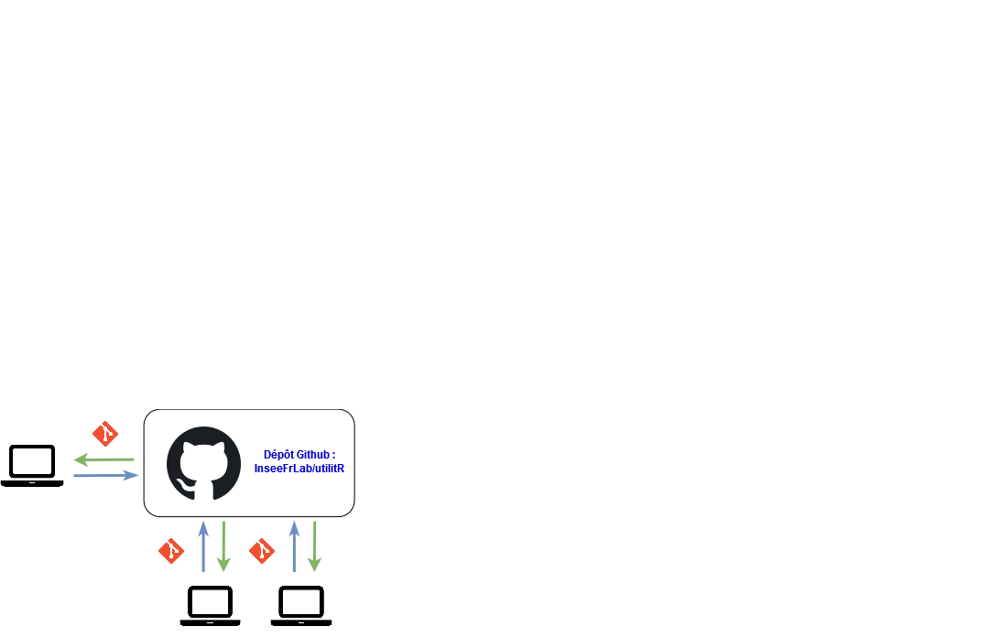
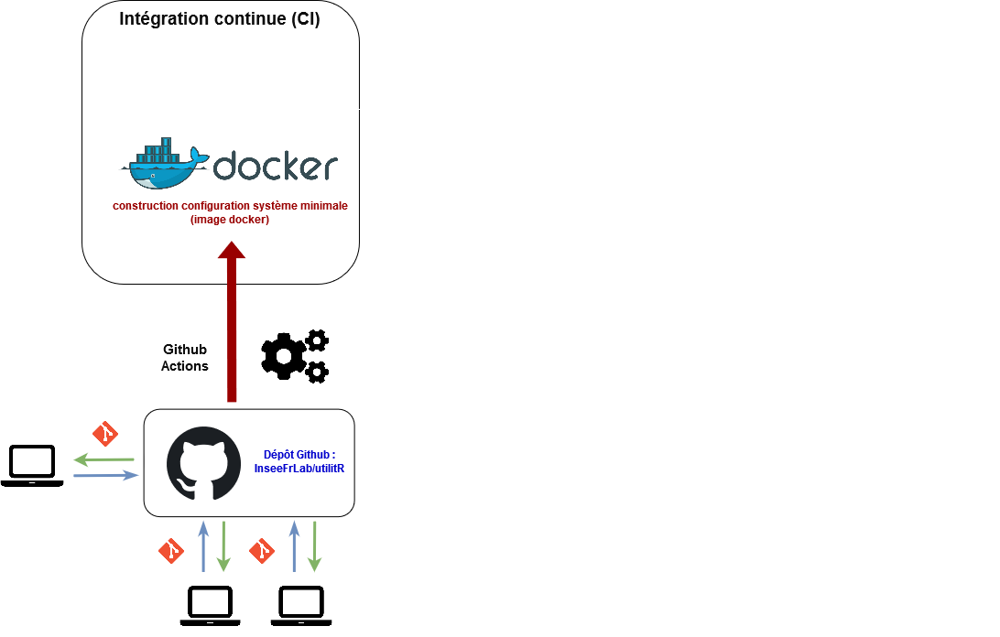
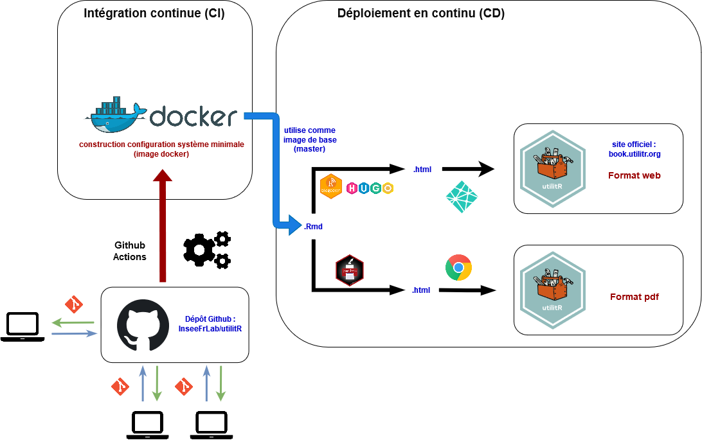
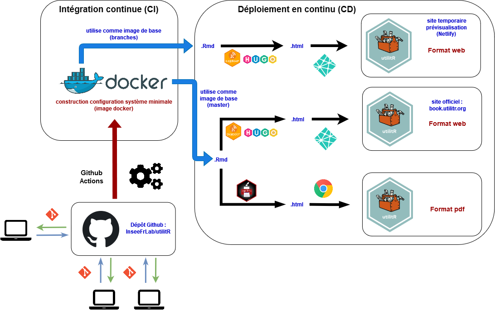

# Introduction

```{r setup, include=FALSE}
options(htmltools.dir.version = FALSE)
```

.sauterligne3[
Le projet `utilitR` vise à produire une documentation collaborative sur `R`,
destinée principalement aux agents du Service statistique public (mais pas exclusivement).
]

--
.sauterligne2[
Plan de la présentation :
]

- Présentation du projet ;
- Fonctionnement collaboratif d'`utilitR` ;
- Collaboration sur `Github` ;
- Le rôle de l'intégration continue pour se concentrer sur le contenu ;
- Notre retour d'expérience ;

<!----
    + Git & Github
    + CI/CD
----->

---
# 1. Présentation du projet
## Une démarche collaborative et _open source_

* Projet entièrement _open source_ (`r fontawesome::fa("fab fa-github")` [`InseeFrLab`](https://github.com/InseeFrLab/utilitR)) :
    + Tous les codes sources sont disponibles sur Github ;
    + licence ouverte et peu contraignante (`Licence Ouverte 2.0`).
--
* Démarche collaborative impliquant __plus de 25 contributeurs__ :
    + dispersés dans toute la France ;
    + issus de plusieurs institutions du SSP.
    + Un immense merci à eux ! `r emo::ji("applause")`

--
* Organisation horizontale, sur le modèle de `Wikipedia` :
    + relecture par les pairs ;
    + validation collégiale ;
    + discussions publiques, toutes contributions bienvenues. 

<br> __Tout le monde peut contribuer à `utilitR` !__

---
# 1. Présentation du projet
## Des choix techniques au service de la qualité

* Une documentation pensée pour le statisticien :
    + Recommandations adaptées au contexte de travail des agents du service statistique public ;
    + Exemples sur [données réelles Insee](https://www.insee.fr) (grâce au _package_ [`doremifasol`](https://github.com/InseeFrLab/DoReMIFaSol)) ;
    + Documentation entièrement reproductible
[](https://datalab.sspcloud.fr/launcher/inseefrlab-helm-charts-datascience/rstudio?onyxia.friendlyName=%C2%ABrstudio-utilitr%C2%BB&init.personnalInit=%C2%ABhttps%3A%2F%2Fraw.githubusercontent.com%2FInseeFrLab%2FutilitR%2Fmaster%2Fresources%2Finit_9juin.sh%C2%BB&r.version=%C2%ABinseefrlab%2Futilitr%3A0.7.0%C2%BB)
    + Insee: exemples mobilisables dans AUS.

* Processus de publication à l'état de l'art :
    + Plusieurs _outputs_ (site web `r fontawesome::fa("fab fa-firefox")`, livre PDF `r fontawesome::fa("fas fa-file-pdf")`) avec les mêmes codes sources ;
    + Publication automatique à chaque modification des fichiers sources.

    
---
# 1. Présentation du projet
## Une démarche collaborative et _open source_

* Acculturation à des outils favorisant la **reproductibilité** et la **pérennité**, au-delà de l'usage de `r fontawesome::fa("fab fa-r-project")` :
    + `Docker` `r fontawesome::fa("fab fa-docker")` ;
    + `Git` `r fontawesome::fa("fab fa-git-alt")` ;
    + `Github` `r fontawesome::fa("fab fa-github")`.

* La résolution des défis techniques ont permis des évolutions de l'écosystème `R Markdown` :
    + Amélioration du _package_ `pagedown` pour produire la brochure pdf ;
    + Correction d'un bug dans le _package_ `rmarkdown` pour produire le site internet.

<br>

__Le projet `utilitR` est un laboratoire qui préfigure les évolutions des méthodes de travail des statisticiens.__

---
# 1. Présentation du projet
## La communauté des contributeurs

```{r, echo = FALSE}
knitr::include_graphics("https://i2.wp.com/akramsideas.com/wp-content/uploads/2013/07/minions.jpg")
```

__Rejoignez l'aventure `utilitR` !__


---
# 1. Présentation du projet
## Diffusion de la documentation

La documentation est diffusée sous trois formes :

- `r fontawesome::fa("fab fa-firefox")` un site internet ([www.utilitr.org](https://www.utilitr.org)) ;
- `r fontawesome::fa("fas fa-print")` chaque fiche est disponible en format A4 sur le site internet ;
- `r fontawesome::fa("fas fa-file-pdf")` l'intégralité de la documentation en format pdf. 

<br> Il est envisagé que le site internet soit actualisé en continu, tandis que la brochure pdf serait publiée de façon ponctuelle et millésimée (mais produite de manière automatique).

<br> `utilitR` est en évolution constante, venez proposer vos idées ou donner un coup de main !


<!---- PARTIE 2 ---------------->

---
# 2. Fonctionnement du projet
## Organisation du projet

**Le projet `utilitR` est un projet collaboratif, horizontal, _open source_ et ouvert à tous, auquel tous les agents peuvent contribuer.**

--
* Cinq principes détaillés dans le [manifeste](https://github.com/InseeFrLab/utilitR/blob/master/Manifeste.md) : transparence, ouverture, bienveillance, exigence et reproductibilité.

--

* Organisation sans hiérarchie :
    * Un _groupe de contributeurs_ `r emo::ji("black_nib")` (environ 25), parmi lesquels deux coordinateurs ;
    * Un _comité de parrainage_ composé de managers  `r emo::ji("angel")`: Benoît Rouppert, Arnaud Degorre, Patrick Sillard, Sébastien Roux.
--

* Les travaux sont menés selon les méthodes de développement logiciel (_pull requests_, _issues_) ;
--

* La marche à suivre pour contribuer est détaillée dans le [guide de contribution](https://github.com/InseeFrLab/utilitR/blob/master/CONTRIBUTING.md).

--
<br><br>
**Vous pouvez rejoindre l'équipe de contributeurs à tout moment.**

---
# 2. Fonctionnement du projet
## Organisation du projet

<table class = "tablelol">
  <tr>
    <td style = "width: 35%;">Le comité de parrainage</td>
    <!-- <td></td> -->
    <td>
<div class="row">
  <div class="column">
    
  </div>
  <div class="column">
    
  </div>
  <div class="column">
    
  </div>
</div>
        </td>
     </tr> 
     <tr>
      <td>Les contributeurs</td>
<td> </td>
  </tr>
</table>

---
# 2. Fonctionnement du projet
## Les 5 principes du projet `utilitR`


* __Transparence__ : l'ensemble du projet est librement accessible sur le dépôt Github, sous licence libre ;
* __Ouverture__ : toute personne qui le souhaite peut rejoindre le projet à tout moment. Les modalités de contribution peuvent prendre différentes formes, détaillées dans le guide des contributeurs ;
* __Bienveillance__ : toutes les idées, initiatives et propositions sont les bienvenues, et les contributeurs veillent à se soutenir les uns les autres ;
* __Exigence__ : les modifications de la documentation sont systématiquement soumises à une revue par les contributeurs du projet et ne sont acceptées que lorsqu'elles rencontrent une large approbation ;
* __Reproductibilité__ : les exemples développés dans la documentation doivent être reproductibles.

Ces principes sont exposées dans un
[Manifeste](https://github.com/InseeFrLab/utilitR/blob/master/Manifeste.md)
exposant la philosophie du projet

---
# 2. Fonctionnement du projet
## L'architecture du projet

* Les contributeurs collaborent par l'intermédiaire du dépôt `Github` du projet (www.github.com/inseefrlab/utilitr).

```{r, echo = FALSE, out.width="85%", fig.align="center"}

```

---
# 2. Fonctionnement du projet
## L'architecture du projet

* Des scripts automatiques créent l'environnement informatique de production de la documentation et vérifient que les codes sources ne contiennent pas de bug.


```{r, echo = FALSE, out.width="85%", fig.align="center"}

```

---
# 2. Fonctionnement du projet
## L'architecture du projet

* La documentation est déployée automatiquement en plusieurs formats ;
* Mais il est nécessaire de tester les évolutions avant leur déploiement.

```{r, echo = FALSE, out.width="85%", fig.align="center"}

```


---
# 2. Fonctionnement du projet
## L'architecture du projet

* Chaque contribution est déployée sur un site temporaire pour vérification ;
* Seule la version validée sera sur [www.book.utilitr.org](https://www.book.utilitr.org).

```{r, echo = FALSE, out.width="85%", fig.align="center"}

```

---
# 2. Fonctionnement du projet
## Une approche au service de la reproductibilité et de la qualité

C'est le dépôt [`Github` `r fontawesome::fa("fab fa-github")` d'`utilitR`](https://github.com/InseeFrLab/utilitR) qui centralise tout le fonctionnement du projet. Il propose :

* Un __environnement informatique complet et reproductible__ pour produire la documentation (image `Docker` `r fontawesome::fa("fab fa-docker")`) ;

--

* Des scripts d' __intégration continue__ `r fontawesome::fa("fas fa-cogs")` qui vérifient que les contributions ne comportent pas d'erreur de programmation, et que les exemples sont bien reproductibles ;

--

* Des scripts de __déploiement continu__ qui compilent la documentation et déploient le site internet à chaque modification de la branche `master` ;

--

* Un **site de prévisualisation** `r fontawesome::fa("fab fa-firefox")` (via `Netlify`) sur lequel les contributeurs peuvent voir les modifications qu'ils apportent au site, sans que le site public ne soit modifié.

[](https://hub.docker.com/repository/docker/inseefrlab/utilitr/general)
[](https://github.com/InseeFrLab/utilitR/actions)


---
# 3. Quelle collaboration sur Github ?
## Objectif : permettre à tous de contribuer

* __Plusieurs modalités de contribution__ proposées pour offrir légèreté, flexibilité et simplicité ;

--

* Les contributions les plus simples sont possibles _via_ une interface graphique ;

--

    * Le bouton *Edit this page* `r fontawesome::fa("fab fa-github")` sur [www.book.utilitr.org](https://www.book.utilitr.org) permet d'utiliser l'interface visuelle `Github` pour proposer une modification d'une fiche (*pull request* automatiquement créée).

    * Les _issues_ sont des fils de discussion qui permettent des débats et échanges sur tous les sujets :
      + signaler un *bug*, 
      + proposer une nouvelle fiche, 
      + proposer un nouvel exemple, 
      + participer à un débat sur un *package*...

---
# 3. Quelle collaboration sur Github ?
## Objectif : permettre à tous de contribuer


* Pour ajouter des éléments plus substantiels (nouvelles 
fiches, ajout de paragraphe, évolution de la tuyauterie...), il est possible d'ouvrir des *pull requests*.
* Les contributeurs s'entraident pour acquérir la maîtrise des outils.

--

.sauterligne2[
Deux points à retenir :
]

- __Il n'est pas nécessaire de bien connaître Git et Github pour contribuer au projet ;__
- __Contribuer au projet permet de se familiariser avec les méthodes de l'_open source_ qui renforcent la fiabilité des projets.__

---
# 3. Quelle collaboration sur Github ?
## Démonstration

<br><br><br><br>
**[Démonstration !](https://github.com/InseeFrLab/utilitR-website)**


---
# 3. Quelle collaboration sur Github ?
## Méthode de travail

* On a choisi le mode de travail le plus léger (*Github Flow*) ;
* Cependant, les seuls personnes ayant droit d'écriture sur
[InseeFrLab/utilitR](https://github.com/InseeFrLab/utilitR) sont les coordinateurs (mainteneurs) ;
* Les contributeurs travaillent sur des copies du dépôt principal (`forks`) et soumettent les changements à partir de ces copies ;
* Lorsqu'une modification proposée par un contributeur est validée par les autres contributeurs, elle est intégrée au dépôt principal par les coordinateurs.

```{r, echo = FALSE}
knitr::include_graphics("resources/git-tree.png")
```

<br> __Ce mode de travail est exportable à un environnement interne `Gitlab` `r fontawesome::fa("fab fa-gitlab")`__

---
# 4. Intégration continue

## Avantages de l'automatisation des processus :

```{r, eval = FALSE, echo = FALSE, out.width="50%", fig.show="hold"}
knitr::include_graphics("https://crowdspotsimages.s3-us-west-2.amazonaws.com/user-content/LcYPp_4UQjuu44T_RXp8qg.jpeg")
knitr::include_graphics("https://flexagon.com/wp-content/uploads/2020/04/a-world-without-ci.cd-meme.jpg")
```

<!---
Sources :
`https://crowdspotsimages.s3-us-west-2.amazonaws.com/user-content/LcYPp_4UQjuu44T_RXp8qg.jpeg`
`https://flexagon.com/wp-content/uploads/2020/04/a-world-without-ci.cd-meme.jpg`

---->

Chaque action sur `Github` déclenche des scripts pour construire, tester et déployer la mise à jour de la documentation:

+ **allège le travail** des coordinateurs et des contributeurs ;
+ assure un **environnement plus reproductible** ;
+ assure la **cohérence entre les différents formats** ;
+ **facilite le repérage des erreurs** ;
+ permet aux contributeurs d'ignorer les détails techniques de la production de la documentation et de **se concentrer uniquement sur le fond**.

```{r, echo = FALSE, out.width="50%", fig.show="hold", fig.align='center'}
knitr::include_graphics("https://flexagon.com/wp-content/uploads/2020/04/a-world-without-ci.cd-meme.jpg")
```

---
# 4. Intégration continue
## `R Markdown`, *un langage pour les gouverner tous*

<!-- en un site web ou un PDF cohérent (gestion des numéros de chapitre, des -->
<!-- liens entre fiches, etc.) -->

<!-- (`.Rmd` ➜ `.md` ➜ `.html`) ; -->
<!-- (`.md` ➜ `.html` ➜ `.pdf`) ; -->

* Les codes sources de la documentation prennent la forme de fichiers `R Markdown`, qui rassemblent les textes et les exemples de codes ;
* `R` compile ces codes sources de deux manières :
    + Production d'un site internet grâce au _package_ `blogdown` ;
    + Production d'un livre en format A4 grâce au _package_ `pagedown` ;
    + De plus, l'utilisation de `paged.js` permet de transformer chaque page du site internet en un chapitre paginé prêt à être imprimé.
    
--

* Les modèles de document reposent sur les technologies Web standards (CSS et Javascript) et sont organisés sous la forme d'un _package_.

--

<br>
Utiliser les outils les plus appropriés pour réaliser une tâche donnée (compilation en site web, en PDF...).


---
# 5. Retour d'expérience
## Git `r fontawesome::fa("fab fa-git-alt")` et Github `r fontawesome::fa("fab fa-github")`: un **écosystème efficace**

* Une __unique source de vérité__ avec au même endroit :
    + le contenu validé ;
    + le contenu en cours de rédaction ;

--

* **Pas de mail** pour s'échanger des fichiers ou des informations ;
    + Les informations importantes sont archivées directement dans le projet, pas dans une boîte mail ;

--

* Organiser le travail collaboratif de façon **ouverte** et **transparente** :
    + tout le monde peut proposer des modifications (correction coquille, rédaction fiche, etc.) ;
    + tout le monde peut donner son avis.

--

* **Pas besoin d'être un expert `Git`** pour contribuer à un projet collaboratif :
    + Besoin d'un ou deux facilitateurs ou coach `Git` ;
    + Proposer des modalités de contribution facilitées (bouton *Edit this page* `r fontawesome::fa("fab fa-github")` sur le site)
    + Intérêt d'avoir une messagerie instantanée `r fontawesome::fa("fas fa-comment")` en complément.


---
# 5. Retour d'expérience
## Git `r fontawesome::fa("fab fa-git-alt")` et Github `r fontawesome::fa("fab fa-github")`: **ce n'est pas suffisant**

* Il faut de la **communication** `r emo::ji("comment")`.
* Il est important d'avoir un outil de communication collaboratif en parallèle du dépôt Github : (Tchap dans le cas d'`utilitR`) ;
* Cet outil permet de se coordonner et de faire circuler l'information :
    + publication nouvelle fiche ;
    + besoin relecteur ou rédacteur ;
    + *debug* ;
    + blagues...

    
---
# 5. Retour d'expérience
## Avantages

* Traçabilité élevée des modifications ;
* Simplicité de mise à jour des outputs ;
* Ouverture des codes ;
* Collaboration renforcée ;
* Fiabilité du processus de publication ;
* Projet plus pérenne.

--

## Défis

* Capacité à se coordonner et à s'écouter ;
* Nécessité de hiérarchiser les objectifs ;
* Il faut apprendre à maîtriser les outils ;
* Il faut trouver du temps pour contribuer ;
* Importance d'avoir quelques contributeurs expérimentés.


---
# 5. Retour d'expérience
## Une "petite" bourde lors de la transition de Gitlab à Github (décembre 2020)

* Transition vers [Github `r fontawesome::fa("fab fa-github")`](https://github.com/InseeFrLab/utilitR) pour donner plus de visibilité que sur Gitlab `r fontawesome::fa("fab fa-gitlab")`

* Volonté de ne pas perdre l'historique du dépôt (commits, issues, pull request)
    + Utilisation d'un outil ([node-gitlab-2-github](https://github.com/piceaTech/node-gitlab-2-github)) pour récupérer *issues* et *pull request*

* Problème: *oubli* désactivation notification mail
* Résultat: Olivier a reçu 2700 mails `r emo::ji("sweat_smile")`

```{r, echo = FALSE, out.width="50%", fig.show="hold"}
knitr::include_graphics("resources/Spamomatic.jpg")
knitr::include_graphics("resources/Spamomatic2.jpg")
```


---
# 5. Retour d'expérience
## Les coordinateurs du projet

```{r, echo = FALSE, out.width="45%", fig.align='center'}
knitr::include_graphics("https://images-na.ssl-images-amazon.com/images/I/91CJLS0pRJL.jpg")
```


---
# 5. Retour d'expérience
## Le projet aujourd'hui et demain

* Un portail d'accès sous forme de site *web* :
    + La documentation principale est disponible sur [www.book.utilitr.org](www.book.utilitr.org) ;
    + Guide des bonnes pratiques en `R` disponible sur [www.pratiques.utilitr.org](www.pratiques.utilitr.org).

* Un point d'entrée : <https://www.utilitr.org> ;
* Un mail de contact : utilitr-contact@insee.fr.

--

<br>

* Besoin de nouveaux contributeurs pour aller plus loin:
    + Ajouter de nouveaux contenus ;
    + Mettre à jour certains contenus ;
    + Après `utilitR` `r fontawesome::fa("fab fa-r-project")`, `utilython` `r fontawesome::fa("fab fa-python")` ?

--
      + Lino est fou `r emo::ji("fear")` !
      
--

<br>
__`utilitR` est une documentation vivante qui a besoin de vous !__

---
# Remerciements

<!-- Le projet `utilitR` est un projet collaboratif qui a bénéficié des contributions de :  -->
<!-- r paste0(paste(format(Filter(function(x) !("cph" %in% x$role), desc::desc_get_authors()), include = c("given", "family")), collapse = ", "), ".") -->

.small90[
.auteurs[

Contributeurs : Raphaële Adjerad, Mathias André, Pierre-Yves Berrard, Lionel Cacheux, Arthur Cazaubiel, Frédérique Cornuau, Sylvain Daubrée, Aurélien d'Isanto, Arlindo Dos Santos, Alexis Eidelman, Marie-Emmanuelle Faure, Gilles Fidani, Lino Galiana, Gaëlle Genin, Pierre Lamarche, Claire Legroux, Romain Lesur, Jean-Daniel Lomenède, Pascal Mercier, Olivier Meslin, Violaine Poirot, Géraldine Rochambeau, Clément Rousset, Milena Suarez Castillo, Cédric Tassart.

Coordination : Lino Galiana et Olivier Meslin.

Comité de parrainage : Arnaud Degorre, Benoît Rouppert, Patrick Sillard et Sébastien Roux.

Logo : Anna Schlaifer.

Les contributeurs remercient Julien Taquet et Marc Hufschmitt pour leur aide précieuse sur la mise en forme du site et de la brochure.
]
]

---
background-image: url('resources/logo-utilitr.png')
background-size: 7cm
background-position: 8.5cm 3cm

# Merci !
