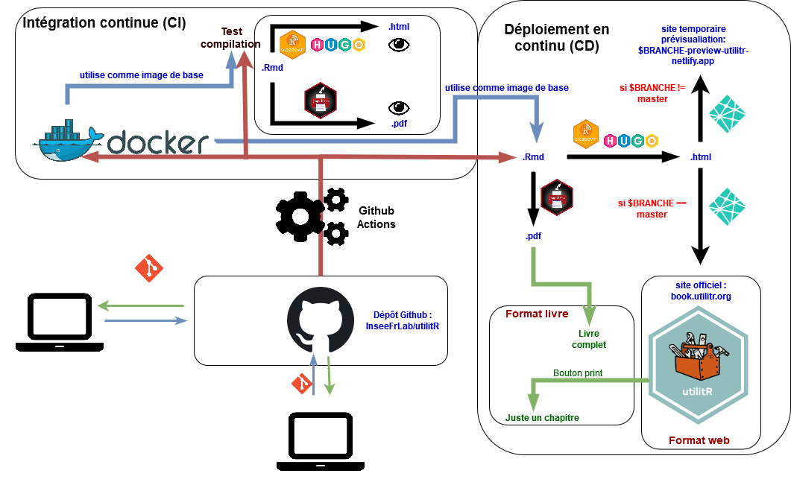

# Introduction

```{r setup, include=FALSE}
options(htmltools.dir.version = FALSE)
```

.sauterligne3[
Le projet `utilitR` vise à produire une documentation collaborative sur `R`,
destinée principalement aux agents du Service statistique public (mais pas exclusivement).
]

--
.sauterligne2[
Plan de la présentation :
]

- Présentation du projet ;
- Fonctionnement du projet: panorama ;
- Notre retour d'expérience ;
- Pourquoi mettre en place ce type d'approche ;
- Fonctionnement collaboratif d'utilitR ;
    + Git & Github
    + CI/CD


---
# 1. Présentation du projet
## Une démarche collaborative et _open source_

* Projet entièrement _open source_ (`r fontawesome::fa("fab fa-github")` [`InseeFrLab`](https://github.com/InseeFrLab/utilitR)) :
    + licence ouverte, permissive (`Licence Ouverte 2.0`) ;
    + un manifeste exprimant un certain nombre de valeurs dont la transparence.
* Démarche collaborative impliquant __plus de 25 contributeurs__ :
    + dispersés dans toute la France ;
    + issus de plusieurs institutions du SSP.
    + Un immense merci à eux ! `r emo::ji("applause")`
* Organisation horizontale, sur le modèle de `Wikipedia` :
    + relecture par les pairs ;
    + validation collégiale ;
    + discussions publiques, toutes contributions bienvenues. 

---
# 1. Présentation du projet
## Des choix techniques au service de la qualité

* Une documentation pensée pour le statisticien :
    + Recommandations adaptées au contexte de travail des agents du service statistique public ;
    + Exemples sur [données réelles Insee](https://www.insee.fr) (grâce au _package_ [`doremifasol`](https://github.com/InseeFrLab/DoReMIFaSol)) ;
    + Documentation entièrement reproductible
[](https://datalab.sspcloud.fr/launcher/inseefrlab-helm-charts-datascience/rstudio?onyxia.friendlyName=%C2%ABrstudio-utilitr%C2%BB&init.personnalInit=%C2%ABhttps%3A%2F%2Fraw.githubusercontent.com%2FInseeFrLab%2FutilitR%2Fmaster%2Fresources%2Finit_9juin.sh%C2%BB&r.version=%C2%ABinseefrlab%2Futilitr%3A0.7.0%C2%BB)
    + Insee: exemples mobilisables dans AUS.

* Processus de publication à l'état de l'art :
    + Plusieurs _outputs_ (site web `r fontawesome::fa("fab fa-firefox")`, livre PDF `r fontawesome::fa("fas fa-file-pdf")`) avec les mêmes codes sources ;
    + Publication automatique à chaque modification des fichiers sources.

    
---
# 1. Présentation du projet
## Une démarche collaborative et _open source_

* Acculturation à des outils favorisant la **reproductibilité** et la **pérennité**, au-delà de l'usage de `r fontawesome::fa("fab fa-r-project")` :
    + `Docker` `r fontawesome::fa("fab fa-docker")` ;
    + `Git` `r fontawesome::fa("fab fa-git-alt")` ;
    + `Github` `r fontawesome::fa("fab fa-github")`.

* Défis techniques surmontés ont permis des évolutions de l'écosystème `R Markdown` :
    + Solutions bénéficiant à l'ensemble de la communauté `r fontawesome::fa("fab fa-r-project")`.
    + Sur `r fontawesome::fa("fab fa-github")`: [rstudio/rmarkdown#2146](https://github.com/rstudio/rmarkdown/pull/2146), [rstudio/rmarkdown#2145](https://github.com/rstudio/rmarkdown/issues/2145), [rstudio/bookdown#1101](https://github.com/rstudio/bookdown/issues/1101), [rstudio/bookdown#1117](https://github.com/rstudio/bookdown/issues/1117), [rstudio/pagedown#217](https://github.com/rstudio/pagedown/issues/217), [rstudio/pagedown#217](https://github.com/rstudio/pagedown/issues/218), [rstudio/pagedown#224](https://github.com/rstudio/pagedown/pull/224)

<br>

__Le projet `utilitR` est un laboratoire qui préfigure les évolutions des méthodes de travail des statisticiens.__

---
# 1. Présentation du projet
## Une démarche collaborative et _open source_

```{r, echo = FALSE}
knitr::include_graphics("https://i2.wp.com/akramsideas.com/wp-content/uploads/2013/07/minions.jpg")
```

---
# 1. Présentation du projet
## Méthode de travail : reproductibilité et qualité

Le dépôt [`Github` `r fontawesome::fa("fab fa-github")` d'`utilitR`](https://github.com/InseeFrLab/utilitR) propose :

* Un __environnement informatique complet et reproductible__ pour produire la documentation (image `Docker` `r fontawesome::fa("fab fa-docker")`) ;
* Des scripts d' __intégration continue__ `r fontawesome::fa("fas fa-cogs")` qui vérifient que les contributions ne comportent pas d'erreur de programmation, et que les exemples sont bien reproductibles ;
* Des scripts de __déploiement continu__ qui compilent la documentation et déploient le site internet à chaque modification de la branche `master` ;
* Un **site de prévisualisation** `r fontawesome::fa("fab fa-firefox")` (via `Netlify`) sur lequel les contributeurs peuvent voir les modifications qu'ils apportent au site, sans que le site public ne soit modifié.

[](https://hub.docker.com/repository/docker/inseefrlab/utilitr/general)
[](https://github.com/InseeFrLab/utilitR/actions)
---
# 1. Présentation du projet
## Diffusion de la documentation

La documentation est diffusée sous trois formes :

- `r fontawesome::fa("fab fa-firefox")` un site internet ([www.utilitr.org](https://www.utilitr.org)) ;
- `r fontawesome::fa("fas fa-print")` chaque fiche est disponible en format A4 sur le site internet ;
- `r fontawesome::fa("fas fa-file-pdf")` l'intégralité de la documentation en format pdf. 

<br> Il est envisagé que le site internet soit actualisé en continu, tandis que la brochure pdf serait publiée de façon ponctuelle et millésimée.


<!---- PARTIE 2 ---------------->

---
# 2. Fonctionnement du projet
## Organisation du projet

**Le projet `utilitR` est un projet collaboratif, horizontal, _open source_ et ouvert à tous, auquel tous les agents peuvent contribuer.**

--
* Cinq principes détaillés dans le [manifeste](https://github.com/InseeFrLab/utilitR/blob/master/Manifeste.md) : transparence, ouverture, bienveillance, exigence et reproductibilité.

--

* Organisation sans hiérarchie :
    * Un _groupe de contributeurs_ `r emo::ji("black_nib")` (environ 25), parmi lesquels deux coordinateurs (Lino Galiana et Olivier Meslin) ;
    * Un _comité de parrainage_ composé de managers  `r emo::ji("angel")`: Benoît Rouppert, Arnaud Degorre, Patrick Sillard, Sébastien Roux.
--

* Les travaux sont menés selon les méthodes de développement logiciel (_pull requests_, _issues_) ;
--

* La marche à suivre pour contribuer est détaillée dans le [guide de contribution](https://github.com/InseeFrLab/utilitR/blob/master/CONTRIBUTING.md).

--
<br>
**Vous pouvez rejoindre l'équipe de contributeurs à tout moment.**

---
# 2. Fonctionnement du projet
## Organisation du projet

<table>
   <tr>
      <td>Les contributeurs</td>

      <td>Le comité de parrainage</td>
  </tr>
  <tr>
    <td> </td>

    <td></td>
   </tr> 
</table>


---
# 2. Fonctionnement du projet
## Méthode de travail: vision d'ensemble du processus

Le projet `utilitR` utilise des méthodes d'intégration continue à l'état de l'art :

```{r, echo = FALSE}

```


---
# 3. Retour d'expérience
## Git `r fontawesome::fa("fab fa-git-alt")` et Github `r fontawesome::fa("fab fa-github")`: un **écosystème efficace**

* une __unique source de vérité__ avec au même endroit:
    + le contenu validé ;
    + le contenu en cours de rédaction ;
* **pas de mail** pour s'échanger des fichiers ou des informations ;
* organiser le travail collaboratif de façon **ouverte** et **transparente** :
    + tout le monde peut proposer des modifications (correction coquille, rédaction fiche, etc.) ;
    + tout le monde peut donner son avis.

* **Pas besoin d'être un expert `Git`** pour contribuer à un projet collaboratif
    + Besoin d'un ou deux facilitateurs ou coach `Git` ;
    + Intérêt d'avoir une messagerie instantanée `r fontawesome::fa("fas fa-comment")` en complément ;
    + Proposer des modalités de contribution facilitées (bouton *Edit this page* `r fontawesome::fa("fab fa-github")` sur le site)
    + Informations importantes à archiver directement dans le projet, pas dans une boîte mail

---
# 3. Retour d'expérience
## Git `r fontawesome::fa("fab fa-git-alt")` et Github `r fontawesome::fa("fab fa-github")`: **ce n'est pas suffisant**

* Il faut de la **communication** `r emo::ji("comment")`.
* Besoin d'un outil de communication collaboratif en parallèle
    + Tchap
* Permet de faire circuler l'information :
    + publication nouvelle fiche
    + besoin relecteur ou rédacteur
    + *debug*
    + blagues...

    
---
# 3. Retour d'expérience
## Résultats

* traçabilité parfaite ;
* simplicité de mise à jour ;
* ouverture ;
* collaboration renforcée ;
* fiabilité du processus de publication ;
* projet plus pérenne

<br>
__On peut faire des trucs de fou avec Rmardown associé à Git + Github/Gitlab : un site web et un livre de 350 pages avec les mêmes fichiers sources__

---
# 3. Retour d'expérience
## Une "petite" bourde lors de la transition de Gitlab à Github (décembre 2020)

* Volonté de ne pas perdre l'historique du dépôt (commits, issues, pull request)

* Utilisation d'un super outil:  [node-gitlab-2-github](https://github.com/piceaTech/node-gitlab-2-github)
    + fait le lien entre les comptes Gitlab et Github

* problème: j'ai oublié de désactiver la notification mail
* Résultat: Olivier a reçu 2700 mails `r emo::ji("sweat_smile")`

```{r, echo = FALSE, out.width="50%", fig.show="hold"}

knitr::include_graphics("resources/Spamomatic2.jpg")
```


---
# 3. Retour d'expérience
## Les mainteneurs du projet

```{r, echo = FALSE, out.width="45%"}
knitr::include_graphics("https://images-na.ssl-images-amazon.com/images/I/91CJLS0pRJL.jpg")
```


---
# 4. Quelle collaboration sur Github ?
## Les 5 valeurs du projet `utilitR`


* __Transparence__: l'ensemble du projet est librement accessible sur le dépôt Github, sous licence libre;
* __Ouverture__: tout agent de l'Insee qui le souhaite peut rejoindre le projet à tout moment. Les modalités de contribution peuvent prendre différentes formes, détaillées dans le guide des contributeurs;
* __Bienveillance__: toutes les idées, initiatives et propositions sont les bienvenues, et les contributeurs veillent à se soutenir les uns les autres;
* __Exigence__: les modifications de la documentation sont systématiquement soumises à une revue par les contributeurs du projet et ne sont acceptées que lorsqu'elles rencontrent une large approbation;
* __Reproductibilité__: les exemples développés dans la documentation doivent être reproductibles.

Ces valeurs sont exposées dans un
[Manifeste](https://github.com/InseeFrLab/utilitR/blob/master/Manifeste.md)
exposant la philosophie du projet

---
# 4. Quelle collaboration sur Github ?
## Adapter la contribution au type

* Plusieurs modalités de contribution proposées pour offrir:
    + légèreté
    + flexibilité
* Les modalités les plus simples sont possibles via une interface graphique:
    + *Issues* : espace de débat et d'échanges: signaler un *bug*, proposer 
une nouvelle fiche, un nouvel exemple, participer à un débat sur un package...
    + Un bouton *Edit source files* pour utiliser l'interface visuelle Github
afin d'éditer la dernière version de la fiche (la source de vérité) et proposer
un changmeent (pull request)
* Des *pull request* pour ajouter des éléments plus substanciels (nouvelles 
fiches, ajout de paragraphe, évolution de la tuyauterie...)

> ** Acculturation aux méthodes de l'open source qui renforcent la fiabilité des projets**

---
# 4. Quelle collaboration sur Github ?
## L'adoption du *Github Flow* 

```{r, echo = FALSE}
knitr::include_graphics("https://www.johnnybehague.fr/wp-content/uploads/2018/09/githubflow.png")
```

Crédit: [Johnny Behague](https://www.johnnybehague.fr) à partir de la
[documentation Github](https://guides.github.com/introduction/flow/)


---
# 4. Quelle collaboration sur Github ?
## Le *Github Flow* en pratique

* On a choisi le mode de travail le plus léger ;
* Cependant, les seuls personnes ayant droit d'écriture sur
[InseeFrLab/utilitR](https://github.com/InseeFrLab/utilitR) sont Olivier Meslin et Lino Galiana

```{r, echo = FALSE}
knitr::include_graphics("resources/git-tree.png")
```

* Les contributeurs utilisent des `forks` (des copies du dépôt principal) et soumettent les changements à partir de ces copies


---
# 6. Intégration continue

## Pourquoi faire de l'intégration continue ?

```{r, echo = FALSE, out.width="50%", fig.show="hold"}
knitr::include_graphics("https://crowdspotsimages.s3-us-west-2.amazonaws.com/user-content/LcYPp_4UQjuu44T_RXp8qg.jpeg")
knitr::include_graphics("https://flexagon.com/wp-content/uploads/2020/04/a-world-without-ci.cd-meme.jpg")
```

Sources :

* `https://crowdspotsimages.s3-us-west-2.amazonaws.com/user-content/LcYPp_4UQjuu44T_RXp8qg.jpeg`
* `https://flexagon.com/wp-content/uploads/2020/04/a-world-without-ci.cd-meme.jpg`

--

L'automatisation de ces processus présente de multiples avantages :

+ elle allège le travail des coordinateurs et des contributeurs ;
+ elle assure un environnement plus reproductible et facilite le repérage des erreurs ;
+ elle permet aux contributeurs d'ignorer les détails techniques de la production de la documentation et de se concentrer uniquement sur le fond.


---
# 6. Intégration continue
## `R Markdown`, *un langage pour les gouverner tous*

<!-- en un site web ou un PDF cohérent (gestion des numéros de chapitre, des -->
<!-- liens entre fiches, etc.) -->

<!-- (`.Rmd` ➜ `.md` ➜ `.html`) ; -->
<!-- (`.md` ➜ `.html` ➜ `.pdf`) ; -->

* Les codes sources de la documentation prennent la forme de fichiers `R Markdown`, qui rassemblent les textes et les exemples de codes ;
* `R` compile ces codes sources de deux manières :
    + Production d'un site internet grâce au _package_ `blogdown` ;
    + Production d'un livre en format A4 grâce au _package_ `pagedown` ;
    + De plus, l'utilisation de `paged.js` permet de transformer chaque page du site internet en un chapitre paginé prêt à être imprimé.
* Les modèles de document reposent sur les technologies Web standards (CSS et Javascript) et sont organisés sous la forme d'un _package_.

--

<br>
* Avantages :
    + le livre et le site web sont générés à partir des mêmes codes sources ;
    + L'utilisation des outils technologies Web permet de ne pas utiliser `LaTeX` ;
    + Le projet `utilitR` a induit des évolutions de l'écosystème `R Markdown` qui bénéficient à de nombreux utilisateurs.


---
# Où en est le projet aujourd'hui ?

* Un portail d'accès sous forme de site *web* :
    + La documentation principale est disponible sur [www.book.utilitr.org](www.book.utilitr.org) ;
    + Guide des bonnes pratiques en `R` disponible sur [www.pratiques.utilitr.org](www.pratiques.utilitr.org).

* Un point d'entrée: <https://www.utilitr.org>

---
# 3. Quelques termes utilisés dans la présentation
## Définitions

|                        |  |
|------------------------|--|
| Git                    |  |
| Github                 |  |
| Branches               |  |
| Pull request           |  |
| Github Flow            |  |
| Conteneur              |  |
| Intégration continue   |  |
| CI/CD                  |  |
| devops                 |  |

---
# Remerciements

<!-- Le projet `utilitR` est un projet collaboratif qui a bénéficié des contributions de :  -->
<!-- r paste0(paste(format(Filter(function(x) !("cph" %in% x$role), desc::desc_get_authors()), include = c("given", "family")), collapse = ", "), ".") -->

.small90[
.auteurs[

Contributeurs : Raphaële Adjerad, Mathias André, Pierre-Yves Berrard, Lionel Cacheux, Arthur Cazaubiel, Frédérique Cornuau, Sylvain Daubrée, Aurélien d'Isanto, Arlindo Dos Santos, Alexis Eidelman, Marie-Emmanuelle Faure, Gilles Fidani, Lino Galiana, Gaëlle Genin, Pierre Lamarche, Claire Legroux, Romain Lesur, Jean-Daniel Lomenède, Pascal Mercier, Olivier Meslin, Violaine Poirot, Géraldine Rochambeau, Clément Rousset, Milena Suarez Castillo, Cédric Tassart.

Coordination : Lino Galiana et Olivier Meslin.

Comité de parrainage : Arnaud Degorre, Benoît Rouppert, Patrick Sillard et Sébastien Roux.

Logo : Anna Schlaifer.

Les contributeurs remercient Julien Taquet et Marc Hufschmitt pour leur aide précieuse sur la mise en forme du site et de la brochure.
]
]

---
background-image: url('resources/logo-utilitr.png')
background-size: 7cm
background-position: 8.5cm 3cm

# Merci !
