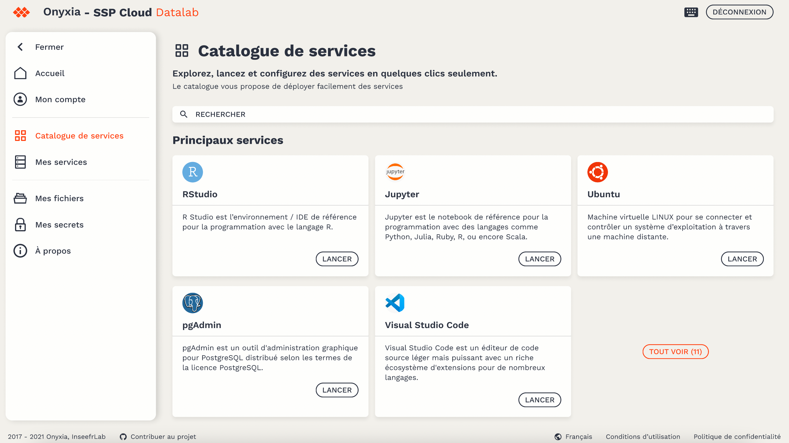
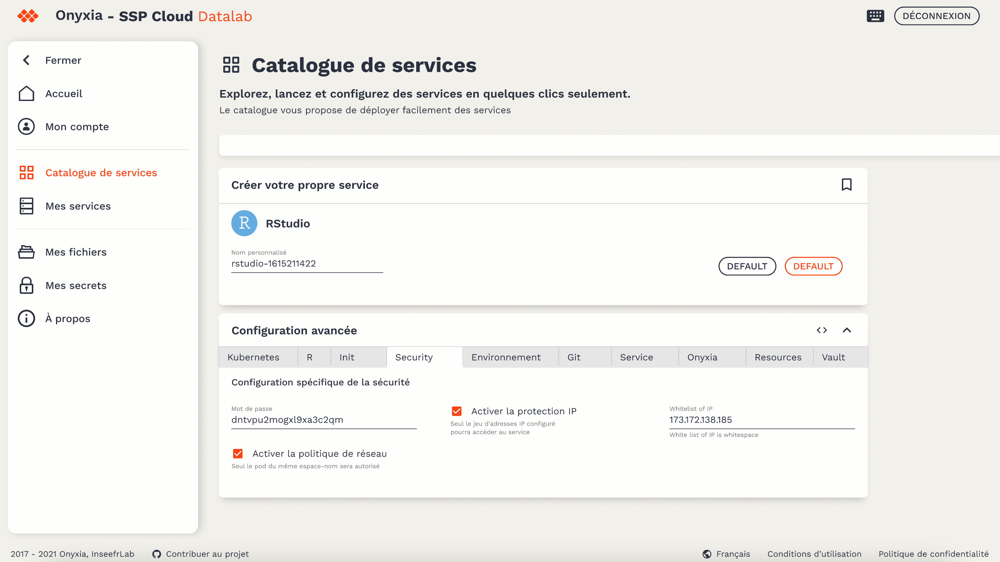
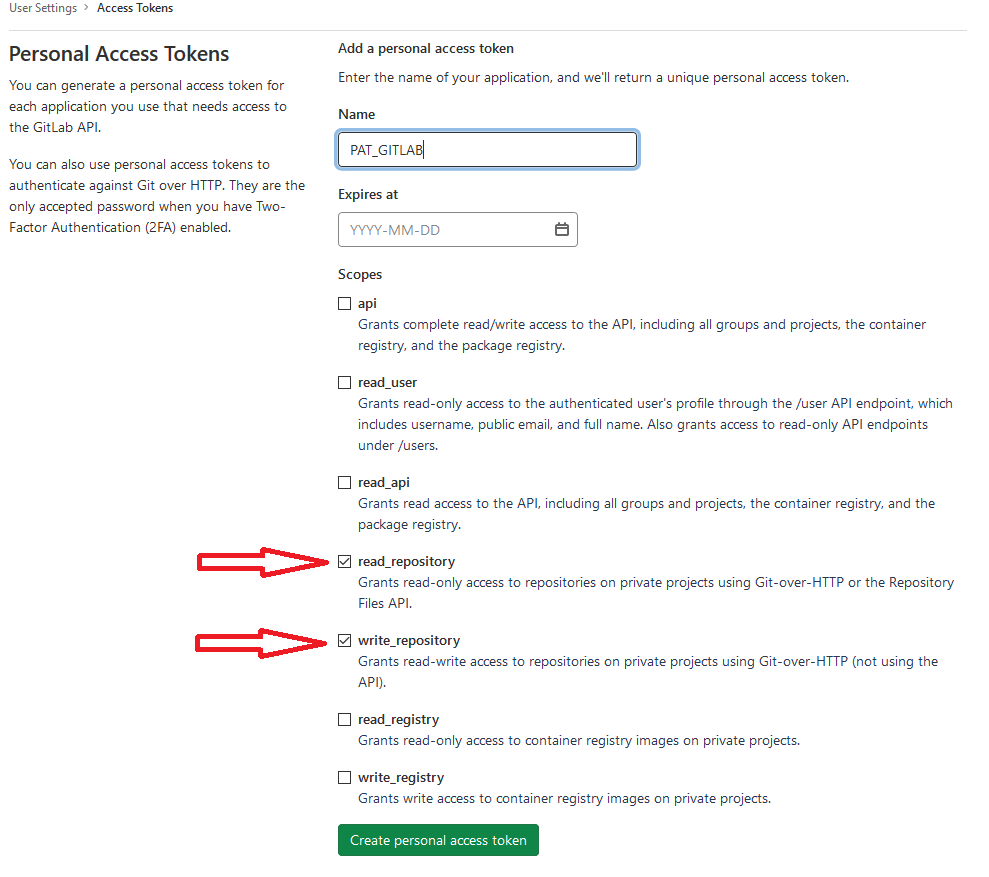
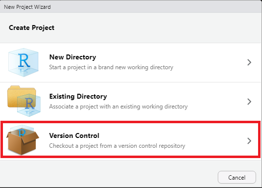
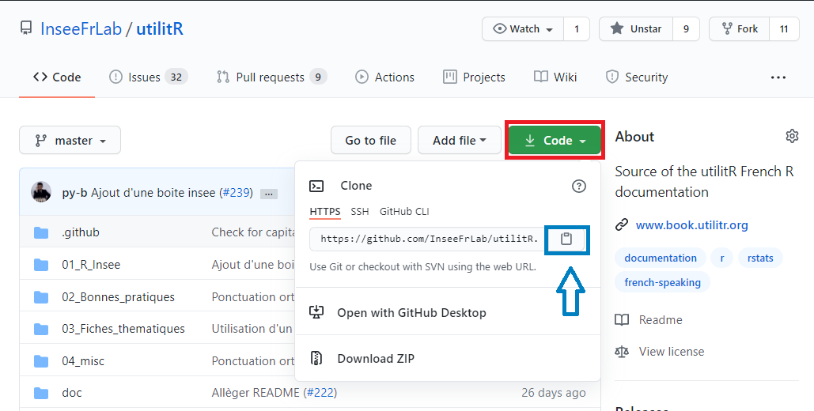
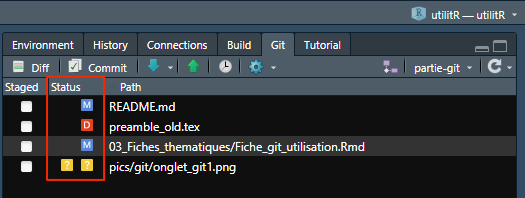
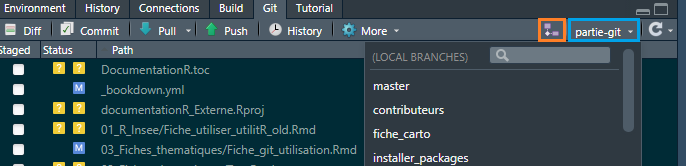

# Introduction

```{r setup, include=FALSE}
options(htmltools.dir.version = FALSE)
```

.sauterligne3[
Le projet `utilitR` vise à produire une documentation collaborative sur `R` et l'écosystème associé (RStudio, Git, Gitlab).
]

.sauterligne2[
Cette documentation est :

- un guide pratique, pas une introduction théorique à `R` ;
- principalement destinée aux agents du Service statistique public (mais pas uniquement);
- issue de la mise en commun des connaissances des agents du SSP sur `R` dans une approche collaborative, sur le modèle de Wikipedia.
]


```{r, echo = FALSE, warning = FALSE, eval = FALSE}
library(knitr)
library(kableExtra)
library(data.table)
description_appariement <- 
  as.data.table(
    data.frame(
      etape = c(
        rep('Utiliser `R` à l’Insee', 5),
        rep("Mener un projet statistique avec `R`", 5),
        rep("Importer des données", 3),
        rep("Manipuler des données", 3),
        rep("Produire des _outputs_", 3)
        ),
      filtres_validation = 
        c(
          "Les environnements de travail avec `R` à l'Insee : AUSv3 et SSP Cloud", 
          "Les environnements de travail avec `R` à l'Insee : AUSv3 et SSP Cloud", 
          "Configurer Git et Gitlab",
          "Personnaliser la configuration de `R`",
          "Gérer les ressources informatiques avec `R`",
          "Utiliser les projets RStudio",
          "Utiliser Git avec RStudio",
          "Installer des packages et gérer les dépendances",
          "Choisir des packages",
          "Demander de l'aide et se documenter",
          "Importer des données (SAS, csv, txt, odt, xlsx...)",
          "Utiliser une API",
          "Utiliser des bases de données",
          "Manipuler des données avec `data.table`",
    # + Manipuler des données (table des données, données textuelles, données spatiales) ;
    # + Utiliser des bases de données PostgreSQL et Oracle ;
    # + Faire des graphiques ;
    # + Rédiger des documents avec `R Markdown` ;
    # + Produire des rapports automatisés avec `R Markdown`.
          "BBB",
          "AAA",
          "BBB",
          "AAA",
          "BBB"
        )
    )
  )

kbl(description_appariement, align = "cll",
    col.names = c("Partie", 
                  "Fiches")
) %>%
  kable_styling(full_width = TRUE) %>%
  row_spec(0, align = 'c') %>%
  column_spec(1, bold = TRUE, width = "6cm") %>%
  column_spec(2, width = "12cm") %>% 
  collapse_rows(columns = 1, 
                valign = "middle", 
                longtable_clean_cut = TRUE)
```


---
# Introduction

.sauterligne2[
Le projet `utilitR` est parti de deux constats : 
]

1. **La transition des agents vers `R` est freinée par une multiplicité d’obstacles** :
    + Eclatement de la documentation de l'écosystème `R` ;
    + Multiplicité de *packages*, de qualité variable et parfois redondants ;
    + Barrière linguistique : la grande majorité de la documentation est en anglais ;
    + Diversité des cas d'usage de `R` à l'Insee et dans le service statistique public ;
    
--

2. **Face à ces difficultés, il n'existe pas de documentation de référence sur l'usage de `R` par les statisticiens** :
    +  La documentation de référence sur `SAS` en français, rédigée par
Axelle Chauvet et largement diffusée à l’Insee et dans le SSP, n'a pas d'équivalent en `R` ;
    + La documentation sur `R` est riche mais propose peu d'exemples sur données réelles, proches des cas d'usage des agents.
    
---
# Introduction

.sauterligne2[
Le projet `utilitR` a pour objectif de produire une documentation qui réponde à deux questions, dans le contexte des travaux de la statistique publique :
]

- Comment (bien) travailler avec `R` pour profiter de la richesse de son écosystème ;
- Comment réaliser efficacement des tâches standards avec `R`.

--

.sauterligne2[
Historique du projet :
]

* Fin 2019 : premières évocations d'une documentation sur `R` ;
* Mars 2020 : lancement du projet ;
* Octobre 2020 : mise en ligne du site :
* Mai 2021 : finalisation des contenus ;
* 8-9 juin 2021 : lancement officiel d'`utilitR` ;

.gray[
* Septembre 2021 : diffusion de la version 1 de la brochure pdf.
]

---
# Introduction

.sauterligne2[
Deux présentations :
]

- 8 juin : le contenu de la documentation `utilitR` ;
- 9 juin : le fonctionnement du projet `utilitR`.

--

.sauterligne2[
Plan de la présentation :
]

- Spécificités du projet ;
- Contenu de la documentation ;
- Modes de diffusion de la documentation ;
- Présentation des ateliers.


---
# Spécificités du projet

.sauterligne2[
Le projet `utilitR` présente trois particularités :
]

- Une démarche collaborative et _open source_ ;
- Une publication entièrement reproductible ;
- Une documentation adaptée aux besoins des agents.


---
# Spécificités du projet

## Une démarche collaborative et _open source_

* Projet entièrement _open source_ (`r fontawesome::fa("fab fa-github")` [`InseeFrLab`](https://github.com/InseeFrLab/utilitR)) ;
* Démarche collaborative impliquant 25 contributeurs :
    + dispersés dans toute la France ;
    + issus de plusieurs institutions du SSP (et même hors SSP).
* Organisation horizontale, sur le modèle de `Wikipedia` :
    + relecture par les pairs ;
    + validation collégiale ;
* Acculturation à des outils favorisant la *reproductibilité* et la *pérennité*, au-delà de l'usage de `r fontawesome::fa("fab fa-r-project")` :
    + `Docker` `r fontawesome::fa("fab fa-docker")` ;
    + `Git` `r fontawesome::fa("fab fa-git-alt")` ;
    + `Github` `r fontawesome::fa("fab fa-github")`.

**Le projet `utilitR` est un projet collaboratif et ouvert à tous, auquel tous les agents peuvent contribuer.**

---
# Spécificités du projet
## Un exemple de publication reproductible

* La documentation est rédigée entièrement avec `R` et les outils de l'écosystème `R Markdown` qui permettent de rassembler paragraphes textes et blocs de code en un seul code source ;
* Processus de publication à l'état de l'art :
    + Plusieurs _outputs_ (site web `r fontawesome::fa("fab fa-firefox")`, livre PDF `r fontawesome::fa("fas fa-file-pdf")`) avec les mêmes codes sources ;
    + Publication automatique à chaque modification des fichiers sources ;
    + La documentation est entièrement reproductible.

* Défis techniques surmontés ont permis des évolutions de l'écosystème `R Markdown` :
    + Solutions bénéficiant à l'ensemble de la communauté `r fontawesome::fa("fab fa-r-project")`.

--

.sauterligne[
**Le projet `utilitR` est un laboratoire qui préfigure les évolutions des méthodes de travail des statisticiens.**
]

---
# Spécificités du projet
## Une documentation adaptée aux besoins des agents

La documentation formule des recommandations claires sur les outils et les _packages_ adaptés à chaque tâche, et comporte des conseils et des remarques relatifs aux bonnes pratiques et est illustrée par des exemples reproductibles utilisant des données de l'Insee.

--

.sauterligne[
La documentation comprend quatre types d'informations mis en évidence dans des encadrés colorés.
]

.sauterligne2[
.small80[
```{r echo = FALSE, message = FALSE, warning = FALSE}
library(magrittr)
library(fontawesome)
texte_recommandation <- "Ce paragraphe présente succinctement les outils et les approches les plus adaptés à la tâche concernée. Chaque fiche ne comprend qu'un seul paragraphe de ce type, au début de la fiche."
texte_conseil        <- "Ce paragraphe détaille les bonnes pratiques à adopter."
texte_remarque       <- "Ce paragraphe donne des informations supplémentaires ou formule une mise en garde."
texte_specificite    <- "Ce paragraphe porte sur une spécificité de l'Insee qui a un impact sur l'usage de <code>R</code>."

symb <-
  c(fa("hand-point-right", fill = "rgba(220, 53, 69, 1)", height = "30px"),
    fa("lightbulb", fill = "rgba(255, 193, 7, 1)", height = "30px"),
    fa("info-circle", fill = "rgba(0, 123, 255, 1)", height = "30px"),
    fa("home", fill = "rgba(81, 81, 81, 1)", height = "30px"))

dt <- 
  as.data.frame(list(
    Nom = c("Recommandation", 
            "Conseil", 
            "Remarque",
            "Spécificité Insee"), 
    Symbole = symb,
    Signification = c(texte_recommandation, 
                      texte_conseil, 
                      texte_remarque,
                      texte_specificite)
  )
  )


output <- 
  dt %>% 
  knitr::kable(escape = F, position = "center", full_width = F, align="ccl") %>%
  kableExtra::column_spec(1, width = "3cm", bold = TRUE) %>%
  kableExtra::column_spec(2, width = "2cm") %>% 
  kableExtra::column_spec(3, width = "12cm") %>% 
  kableExtra::row_spec(0,bold=TRUE, align = "c")
output
```
]
]

---
# Contenu de la documentation
## Une documentation en deux grandes parties

La documentation `utilitR` vise à répondre à deux grandes questions :

- Comment (bien) travailler avec `R` pour profiter de la richesse de son écosystème :
  - Utiliser `R` à l'Insee ;
  - Mener un projet statistique avec `R` ;

--

- Comment réaliser efficacement des tâches standards avec `R` :
  - Importer des données avec `R` ;
  - Manipuler des données avec `R` ;
  - Produire des sorties avec `R`.

---
# Contenu de la documentation
## Une documentation en deux grandes parties

La documentation `utilitR` vise à répondre à deux grandes questions :

.red[
- Comment (bien) travailler avec `R` pour profiter de la richesse de son écosystème :
  - Utiliser `R` à l'Insee ;
  - Mener un projet statistique avec `R` ;
]

- Comment réaliser efficacement des tâches standards avec `R` :
  - Importer des données avec `R` ;
  - Manipuler des données avec `R` ;
  - Produire des sorties avec `R`.


---
# Comment (bien) travailler avec `R` à l'Insee

.sauterligne3[
La première partie de la documentation présente non seulement l'usage de `R` et de RStudio, mais également tout l'écosystème informatique autour de l'usage de `R` à l'Insee, afin d'aider les agents à être autonomes.
]

--

.small80[
<table class="table" style="margin-left: auto; margin-right: auto;">
 <thead>
  <tr>
   <th style="text-align:center;text-align: center;"> Partie </th>
   <th style="text-align:left;text-align: center;"> Fiches </th>
  </tr>
 </thead>
<tbody>
  <tr>
   <td style="text-align:center;width: 6cm; font-weight: bold;vertical-align: middle !important;" rowspan="5"> Utiliser <code class="remark-inline-code">R</code> à l’Insee </td>
   <td style="text-align:left;width: 12cm; "> Utiliser <code class="remark-inline-code">R</code> sur les serveurs AUSv3 </td>
  </tr>
  <tr>
   <td style="text-align:left;width: 12cm; "> Utiliser <code class="remark-inline-code">R</code> sur le SSP Cloud </td>
  </tr>
  <tr>
   
   <td style="text-align:left;width: 12cm; "> Configurer <code class="remark-inline-code">Git</code> et Gitlab </td>
  </tr>
  <tr>
   
   <td style="text-align:left;width: 12cm; "> Personnaliser la configuration de <code class="remark-inline-code">R</code> </td>
  </tr>
  <tr>
   
   <td style="text-align:left;width: 12cm; "> Gérer les ressources informatiques avec <code class="remark-inline-code">R</code> </td>
  </tr>
  <tr>
   <td style="text-align:center;width: 6cm; font-weight: bold;vertical-align: middle !important;" rowspan="5"> Mener un projet statistique avec <code class="remark-inline-code">R</code> </td>
   <td style="text-align:left;width: 12cm; "> Utiliser les projets RStudio </td>
  </tr>
  <tr>
   
   <td style="text-align:left;width: 12cm; "> Utiliser <code class="remark-inline-code">Git</code> et Gitlab avec RStudio </td>
  </tr>
  <tr>
   
   <td style="text-align:left;width: 12cm; "> Utiliser des <i>packages</i> et gérer les dépendances </td>
  </tr>
  <tr>
   
   <td style="text-align:left;width: 12cm; "> Choisir des <i>packages</i> </td>
  </tr>
  <tr>
   
   <td style="text-align:left;width: 12cm; "> Demander de l'aide et se documenter </td>
  </tr>
</tbody>
</table>
]


---
# Comment (bien) travailler avec `R` à l'Insee
## Utiliser `R` à l'Insee

La documentation s'ouvre par une présentation de l'environnement informatique de travail :

- Présentation des environnements informatiques de travail à l'Insee (AUSv3 et SSP Cloud) ;
- Tutoriels détaillés sur la configuration de `R` et la configuration de Git et Gitlab ;
- Fiche-conseil : comment utiliser `R` sans saturer les serveurs de l'Insee.

.sauterligne2[
Des captures d'écran guident les agents à toutes les étapes de l'utilisation des serveurs.
]

---
# Comment (bien) travailler avec `R` à l'Insee

.sauterligne[
Comment lancer un service RStudio sur le SSP Cloud
]

```{r, echo = FALSE, out.width= "95%"}

```

---
# Comment (bien) travailler avec `R` à l'Insee

.sauterligne[
Comment configurer un service RStudio sur le SSP Cloud
]

```{r, echo = FALSE, out.width= "95%"}

```
---
# Comment (bien) travailler avec `R` à l'Insee

.sauterligne[
Comment configurer un _token_ sur Gitlab
]

```{r, echo = FALSE, out.width= "78%"}

```
---
# Comment (bien) travailler avec `R` à l'Insee
## Mener un projet statistique avec `R`

La documentation décrit les outils et les méthodes permettant de mener efficacement des projets statistiques avec `R` :

- l'usage des projets RStudio ;
- Tutoriel détaillé sur l'utilisation de `Git` et Gitlab avec RStudio ;
- Fiches-conseils :
  - comment choisir un _package_ ;
  - comment utiliser les _packages_ `R` ;
  - comment gérer les dépendances des codes ;
  - comment chercher de l'aide et se documenter sur `R`.

---
# Comment (bien) travailler avec `R` à l'Insee

.sauterligne[
Des captures d'écran sont là pour guider les agents.
]


```{r, echo = FALSE, out.width= "38%", out.extra= 'style = "position: absolute; left: 0.5cm; top: 3.7cm; padding: 0; border-width: 0 0 0 1px; border-color: black; border-style: solid;"'}

```
```{r, echo = FALSE, out.width= "50%", out.extra= 'style = "position: absolute; left: 10.8cm; top: 5.5cm; padding: 0; border-width: 0 1px 1px 1px; border-color: black; border-style: solid;"'}

```
```{r, echo = FALSE, out.width= "38%", out.extra= 'style = "position: absolute; top: 11cm; left: 0.5cm; padding: 0;"'}

```
```{r, echo = FALSE, out.width= "50%", out.extra= 'style = "position: absolute; top: 13.5cm; left: 10.8cm; padding: 0;"'}

```

---
# Comment (bien) travailler avec `R` à l'Insee
## Et quand on utilise `R` ailleurs qu'à l'Insee?

--

.sauterligne2[
Les éléments spécifiques à l'Insee sont bien isolés du reste de la documentation, de façon à ce que les autres utilisateurs de `R` puissent se l'approprier aisément.
]

.sauterligne2[
.small90[
.specificite[
Les spécificités informatique de l'Insee sont signalées dans des boîtes colorées.
]
]
]

.sauterligne[
S'ils le souhaitent, les services statistiques ministériels peuvent adapter à moindre coût la documentation à leur propre environnement informatique.
]

---
# Contenu de la documentation
## Une documentation en deux grandes parties

La documentation `utilitR` vise à répondre à deux grandes questions :

- Comment (bien) travailler avec `R` pour profiter de la richesse de son écosystème :
  - Utiliser `R` à l'Insee ;
  - Mener un projet statistique avec `R` ;


.red[
- Comment réaliser efficacement des tâches standards avec `R` :
  - Importer des données avec `R` ;
  - Manipuler des données avec `R` ;
  - Produire des sorties avec `R`.
]


---
# Réaliser des tâches standards avec `R`

.sauterligne3[
La seconde partie de la documentation rassemble un ensemble de fiches thématiques qui expliquent comment réaliser des tâches standards avec `R`.
]

--

.small80[
<table class="table" style="margin-left: auto; margin-right: auto;">
 <thead>
  <tr>
   <th style="text-align:center;text-align: center;"> Partie </th>
   <th style="text-align:left;text-align: center;"> Fiches </th>
  </tr>
 </thead>
<tbody>
  <tr>
   <td style="text-align:center;width: 6cm; font-weight: bold;vertical-align: middle !important;" rowspan="3"> Importer des données </td>
   <td style="text-align:left;width: 12cm; "> Importer des données (SAS, csv, txt, ods, xlsx...) </td>
  </tr>
  <tr>
   
   <td style="text-align:left;width: 12cm; "> Utiliser une API </td>
  </tr>
  <tr>
   
   <td style="text-align:left;width: 12cm; "> Utiliser des bases de données </td>
  </tr>
  <tr>
   <td style="text-align:center;width: 6cm; font-weight: bold;vertical-align: middle !important;" rowspan="5"> Manipuler des données </td>
   <td style="text-align:left;width: 12cm; "> Manipuler des données avec <code class="remark-inline-code">data.table</code> </td>
  </tr>
   <tr>
   <td style="text-align:left;width: 12cm; "> Manipuler des données avec le <code class="remark-inline-code">tidyverse</code> </td>
   <tr>
   <td style="text-align:left;width: 12cm; "> Manipuler des données textuelles </td>
  </tr>
  <tr>
   <td style="text-align:left;width: 12cm; "> Manipuler des données spatiales</td>
   </tr>
  <tr>
   <td style="text-align:left;width: 12cm; "> Utiliser des données d'enquête </td>
  </tr>
  <tr>
   <td style="text-align:center;width: 6cm; font-weight: bold;vertical-align: middle !important;" rowspan="3"> Produire des sorties </td>
   <td style="text-align:left;width: 12cm; "> Réaliser des graphiques </td>
  </tr>
  <tr>
   
   <td style="text-align:left;width: 12cm; "> Rédiger des documents avec <code class="remark-inline-code">R Markdown</code>  </td>
  </tr>
  <tr>
   
   <td style="text-align:left;width: 12cm; "> Produire des rapports automatisés </td>
  </tr>
</tbody>
</table>
]

---
# Réaliser des tâches standards avec `R`
## Des recommandations précises

Les fiches orientent les agents vers les outils adaptés :

- Chaque fiche commence par des **recommandations** précises sur les outils et les _packages_ à utiliser ou à éviter ;
- Ces recommandations indiquent dans quelles situations et sous quelles conditions un _package_ doit être utilisé ;
- Les recommandations reposent sur l'expérience des contributeurs du projet et sont validées après une discussion collégiale.

---

# Réaliser des tâches standards avec `R`
## Des recommandations précises

Voici la recommandation de la fiche _Importer des tables SAS®_ :

.small90[
.indent[
.recommandation[
Deux méthodes sont recommandées pour importer des tables SAS avec `R` :

* méthode en une étape : **utiliser la fonction `read_sas()` du *package* `haven`.**
* méthode en deux étapes : **Exporter les données SAS en format `csv`, puis les importer en `R`**.

Les particularités du format des tables SAS peuvent être source de difficultés lorsqu'on veut les importer avec `R`. **Il est fortement recommandé de tester la méthode d'importation choisie sur un petit échantillon de données avant d'importer les données**, en particulier lorsque celles-ci sont volumineuses. Il est également recommandé d'essayer l'autre méthode si la première ne fonctionne pas correctement.

En revanche, il est **fortement déconseillé** d'utiliser les *packages*  suivants pour importer des données SAS : `sas7dbat`, `foreign`, `Hmisc`, `SASxport`.
]
]
]

---
# Réaliser des tâches standards avec `R`
## Des recommandations précises

Les fiches présentent en détail les outils et les _packages_ recommandés :

- avantages et éventuels inconvénients ;
- utilisation de base et principales options.

--

.sauterligne[
Voici un extrait de la fiche _Importer des fichiers plats_ :
]

.small80[
.sauterligne2[
.extraitdoc[
Le *package* `data.table` permet d'importer des fichiers plats avec la fonction `fread()`. Cette fonction présente trois avantages :

* Elle est très rapide pour importer de gros volumes de données (et nettement plus rapide que les fonctions du *package* `readr`) ;
* Elle permet de sélectionner facilement les colonnes qu'on veut importer (option `select`) ;
* Elle propose un grand nombre d'options, adaptées pour les usages avancés.

]
]
]

---

# Réaliser des tâches standards avec `R`
## Des recommandations précises

.extraitdoc[
.small90[
Les principales options de `fread()` sont les suivantes :
]
.small80[
| Argument         | Valeur par défaut                           | Fonction                                                              |
|------------------|---------------------------------------------|-----------------------------------------------------------------------|
| `file`             | Aucune                                      | Le chemin du fichier à importer                                       |
| `sep`              | Le caractère le plus fréquent parmi `,\t ;:` | Le délimiteur du fichier                                              |
| `header`           | `fread()` essaie de deviner                 | La première ligne contient-elle les noms de colonnes?                 |
| `nrows`            | Pas de limite                                        | Nombre maximum de lignes à importer      |
| `skip`             | `0`                                           | Sauter les n premières lignes (0 par défaut)                          |
| `select`           | `NULL`                                        | Sélectionner les colonnes à importer                                  |
| `colClasses`       | `fread()` essaie de deviner                 | Définir le type des variables                                         |
| `encoding`         | `"unknown"`                                   | Définir l'encodage du fichier (`"UTF-8"` ou `"Latin-1"`)                  |
| `dec`              | Le point                                      | Définir le marqueur décimal                                        |
]
]

---
# Réaliser des tâches standards avec `R`
## Des exemples reproductibles et proches des cas d'usage

La documentation comporte de nombreux exemples. Ces exemples ont trois particularités :

- Les exemples sont **reproductibles** : les agents peuvent reproduire la plupart des exemples de la documentation en en exécutant le code ;
- Les exemples sont **proches des cas d'usages de `R` dans le SSP** : les jeux de données utilisés dans les exemples sont issus de données disponibles sur [insee.fr](www.insee.fr) (code officiel géographique, base permanente des équipements, répertoire Filosofi) ;
- Les jeux d'exemple sont **disponibles dans tous les environnements de travail** (SSP Cloud, AUSv3, poste local). Ils sont mis à disposition dans le _package_ `doremifasolData` développé par des contributeurs du projet.

---
# Réaliser des tâches standards avec `R`
## Des exemples reproductibles et proches des cas d'usage

```{r, echo = FALSE}
# On augmente le nombre de lignes imprimées pour faire apparaître deux catégories
options(tibble.print_min = 6)
options(tibble.print_max = 6)
options(dplyr.print_min  = 6)
options(dplyr.print_max  = 6)
```

.small90[
```{r, echo = TRUE, warning = FALSE, message = FALSE, eval = FALSE}
library(doremifasolData)
library(magrittr)
library(dplyr)

# Calculer le nombre de stations services par département
nombre <- doremifasolData::bpe_ens_2018 %>%
  as_tibble() %>%
  filter(TYPEQU == "B316") %>% 
  group_by(DEP) %>% 
  summarise(nombre_station_serv = sum(NB_EQUIP, na.rm = TRUE)) 
nombre
```
]

--

.small90[
```{r, echo = FALSE, warning = FALSE, message = FALSE, eval = TRUE}
library(doremifasolData)
library(magrittr)
library(dplyr)

nombre <- doremifasolData::bpe_ens_2018 %>%
  as_tibble() %>%
  filter(TYPEQU == "B316") %>% 
  group_by(DEP) %>% 
  summarise(nombre_station_serv = sum(NB_EQUIP, na.rm = TRUE)) 
nombre
```
]

---
# Réaliser des tâches standards avec `R`
## Conseils et remarques

Les fiches contiennent des **conseils** et des **remarques** avec trois objectifs :
- orienter les agents en fonction de leur niveau en `R` ;
- aider les agents à s'approprier l'environnement `R` ;
- indiquer les bonnes pratiques à adopter.

--

.small80[
.indent[
.conseil[
Si vous êtes complètement débutants en `R`, il est recommandé d'utiliser l'utilitaire d'importation de ` RStudio`. Une fois que les données sont correctement importées, vous pourrez copier-coller le code dans votre script `R` et vous familiariser avec les fonctions du *package* `readr`.
]

.remarque[
Il est nettement plus simple de sélectionner des colonnes avec `fread()` qu'avec les fonctions du *package* `readr`. Il est donc recommandé d'utiliser `fread()` lorsque vous souhaitez sélectionner facilement les colonnes à importer.
]
]
]

---
# Réaliser des tâches standards avec `R`
## Références

La documentation `utilitR` est un point d'entrée non exhaustif dans l'environnement `R`. C'est pourquoi chaque fiche se termine par une liste de références pour aller plus loin. Des références en français sont incluses dans la plupart des cas.

.sauterligne[
.extraitdoc[
.small80[
* sur le *package* `stringr` :
    - la [documentation](https://www.rdocumentation.org/packages/stringr) du *package* (en anglais) ;
    - une [vignette](https://cran.r-project.org/web/packages/stringr/vignettes/stringr.html) d'introduction à `stringr` (en anglais) ;
    - un [aide-mémoire](https://github.com/rstudio/cheatsheets/raw/master/strings.pdf) sur `stringr` et les expressions régulières ;
* sur les expressions régulières :
    - [une page en français sur la construction des expressions régulières avec R](https://thinkr.fr/r-les-expressions-regulieres/) ;
    - un très bon [article de blog](http://perso.ens-lyon.fr/lise.vaudor/strings-et-expressions-regulieres/) en français sur les expressions régulières en `R` ;
    - une [vignette](https://cran.r-project.org/web/packages/stringr/vignettes/regular-expressions.html) sur les expressions régulières avec `stringr` (en anglais) ;
    - [un aide-mémoire en anglais sur la construction des expressions régulières avec R](https://github.com/rstudio/cheatsheets/raw/master/strings.pdf) ;
* sur le *package* `RVerbalExpressions` :
    - la [documentation](https://cran.r-project.org/web/packages/RVerbalExpressions/RVerbalExpressions.pdf) du *package* (en anglais) ;
    - une [vignette](https://cran.r-project.org/web/packages/RVerbalExpressions/vignettes/examples.html) d'exemples d'utilisation du *package* (en anglais).
]
]
]

---
# Diffusion de la documentation

La documentation est diffusée sous trois formes :

- `r fontawesome::fa("fab fa-firefox")` un site internet ([www.utilitr.org](https://www.utilitr.org)) ;
    + Documentation principale sur [www.book.utilitr.org](www.book.utilitr.org) ;
    + Guide des bonnes pratiques en `R` sur [www.pratiques.utilitr.org](www.pratiques.utilitr.org) ;
- `r fontawesome::fa("fas fa-print")` chaque fiche est disponible en format A4 sur le site internet ;
- `r fontawesome::fa("fas fa-file-pdf")` l'intégralité de la documentation en format pdf. 

<br> Il est envisagé que le site internet soit actualisé en continu, tandis que la brochure pdf serait publiée de façon ponctuelle et millésimée.

--

.sauterligne2[
Questions :

`r fontawesome::fa("fas fa-question")` Quel format de diffusion préférez-vous?
`r fontawesome::fa("fas fa-question")` La version intégrale de la documentation vous serait-t-elle utile, sachant que chaque fiche est déjà disponible en format A4 imprimable?
`r fontawesome::fa("fas fa-question")` Une version __imprimée et millésimée__ de la brochure (350 pages) vous serait-elle utile?

]

---
# Présentation des ateliers

.sauterligne2[Nous vous proposons six ateliers pour découvrir plus en détail comment vous pouvez utiliser la documentation `utilitR` :
]

* Importer des fichiers plats et des fichiers issus de tableurs	(`csv`, `xlsx`, `ods`) ;
* Manipuler des tables de données avec le `tidyverse`	;
* Faire des graphiques avec `ggplot2`	;
* Utiliser des _packages_, choisir ses _packages_ et gérer ses dépendances ;
* Manipuler des tables de données avec `data.table`	;
* Travailler avec des bases de données en `R` : les fichiers détails du Recensement de la Population.

.sauterligne[
Tous les liens Zoom vers les ateliers sont ici : https://www.utilitr.org/conferences/decouverte-utilitr/.
]

<!-- --- -->
<!-- # Où en est le projet aujourd'hui ? -->

<!-- * Un portail d'accès sous forme de site *web* : -->
<!--     + La documentation principale est disponible sur [www.book.utilitr.org](www.book.utilitr.org) ; -->
<!--     + Guide des bonnes pratiques en `R` disponible sur [www.pratiques.utilitr.org](www.pratiques.utilitr.org). -->

<!-- -- -->

<!-- * Prochaines étapes : -->
<!--     + Mai 2021 : finalisation des contenus ; -->
<!--     + 8-9 juin 2021 : lancement officiel d'`utilitR` ; -->
<!--     + Septembre 2021 : diffusion de la version 1 de la brochure pdf. -->

---
# Remerciements

<!-- Le projet `utilitR` est un projet collaboratif qui a bénéficié des contributions de :  -->
<!-- r paste0(paste(format(Filter(function(x) !("cph" %in% x$role), desc::desc_get_authors()), include = c("given", "family")), collapse = ", "), ".") -->

.small90[
.auteurs[

Contributeurs : Raphaële Adjerad, Mathias André, Pierre-Yves Berrard, Lionel Cacheux, Arthur Cazaubiel, Frédérique Cornuau, Sylvain Daubrée, Aurélien d'Isanto, Arlindo Dos Santos, Alexis Eidelman, Marie-Emmanuelle Faure, Gilles Fidani, Lino Galiana, Gaëlle Genin, Pierre Lamarche, Claire Legroux, Romain Lesur, Jean-Daniel Lomenède, Pascal Mercier, Olivier Meslin, Violaine Poirot, Géraldine Rochambeau, Clément Rousset, Milena Suarez Castillo, Cédric Tassart.

Coordination : Lino Galiana et Olivier Meslin.

Comité de parrainage : Arnaud Degorre, Benoît Rouppert, Patrick Sillard et Sébastien Roux.

Logo : Anna Schlaifer.

Les contributeurs remercient Julien Taquet et Marc Hufschmitt pour leur aide précieuse sur la mise en forme du site et de la brochure.
]
]

---
background-image: url('resources/logo-utilitr.png')
background-size: 7cm
background-position: 8.5cm 3cm

# Merci !


