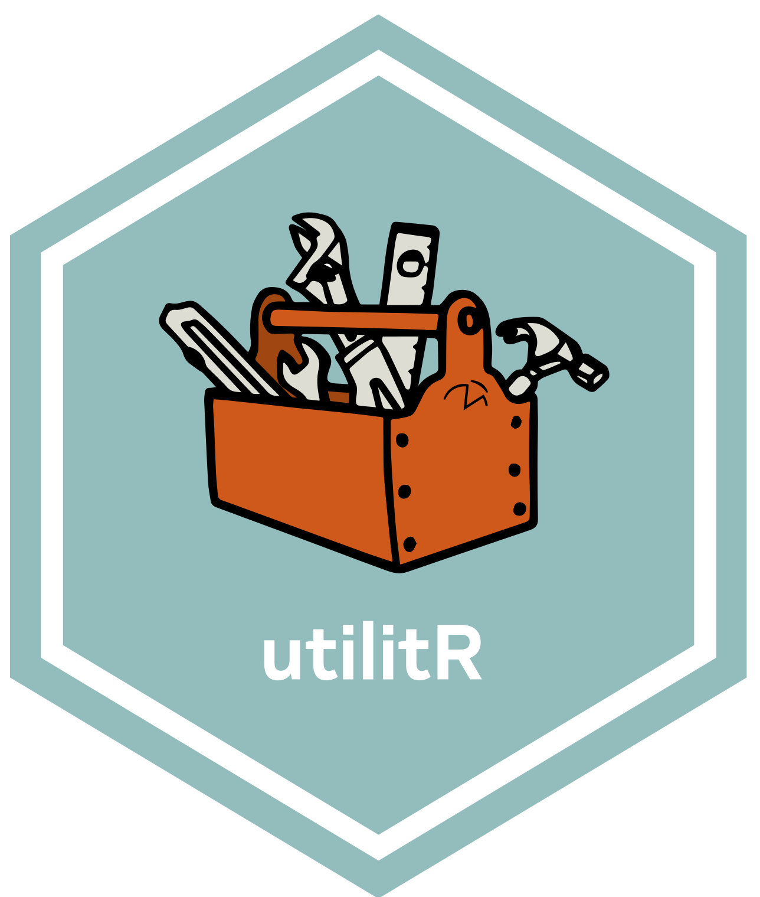

```{r setup, include=FALSE}
options(htmltools.dir.version = FALSE)
```


# Genèse du projet `utilitR`


Le projet `utilitR` est parti de deux constats : 

1. **La transition des agents vers `R` est freinée par une multiplicité d’obstacles** :
    + Diversité des environnements informatiques à l’Insee (poste local, AUS, plateforme innovation puis SSP-Cloud…) ;
    + Difficultés à s’approprier les outils et à en utiliser tout le potentiel :
    + Eclatement de la documentation de l'écosystème `R` ;
    + Multiplicité de *packages*, de qualité variable et parfois redondants ;
    + Barrière linguistique.
2. **Il n'existe pas de documentation de référence sur l'usage de `R` pour le statisticien** :
    +  La documentation de référence sur `SAS` en français, rédigée par
Axelle Chauvet et largement diffusée à l’Insee et dans le SSP, n'a pas d'équivalent en `R` ;
    + La documentation sur `R` est foisonnante mais propose peu d'exemples sur données réelles.

---
# Objectif du projet `utilitR`


Produire une documentation collaborative sur `R`, destinée principalement
aux agents du Service statistique public (mais pas seulement).

* La documentation vise à répondre à deux questions :
    1. Comment (bien) travailler avec `R` pour profiter de la richesse de son 
écosystème ;
    2. Comment réaliser des tâches élémentaires avec `R`.


---
# Contenu de la documentation `utilitR`

La documentation est structurée en deux parties :

* Travailler avec `R` à l'Insee :
    - Présentation des espaces de travail informatiques (AUSv3 et SSP Cloud) ;
    - Comment configurer sa session `R` ;
    - Comment installer et utiliser des _packages_ `R` ;
    - Comment utiliser RStudio et les `RProject` ;
    - Comment utiliser `git` et Gilab avec RStudio...

* Réaliser des tâches standard avec `R` : 
    - Importer des données (SAS, csv, txt, odt, xlsx...) ;
    - Manipuler des tables de données ;
    - Faire des graphiques ;
    - Manipuler des données textuelles ;
    - Manipuler des données spatiales ;
    - Rédiger des documents avec `R Markdown` ;
    - Utiliser des bases de données PostgreSQL et Oracle...


---
# Contenu de la documentation `utilitR`

La documentation `utilitR` a deux particularités :

--

+ **Approche (légèrement) normative** :
    - recommandations sur les _packages_ à utiliser ou à éviter, de façon à orienter
les agents vers les outils adaptés ;
    - conseils sur les bonnes pratiques à adopter ;

-- 

+ **Les exemples sont reproductibles** :
    - la plupart des exemples mobilisent des données disponibles sur [insee.fr](www.insee.fr) ;
    - les données utilisées dans les exemples sont mises à disposition sous forme d'un _package_ (`doremifasolData`).

    
---
# Diffusion de la documentation `utilitR`

La documentation est diffusée sous deux formes :

- un site internet ([www.utilitr.org]) déjà disponible ;
- une brochure pdf imprimable (en cours d'élaboration).

-- 

Le site internet est actualisé en continu, tandis que la brochure pdf est publiée de façon ponctuelle et millésimée.

---

# Positionnement du projet `utilitR`

* Le projet est l’une des multiples initiatives lancées pour faciliter la
transition de l’Insee vers `R` : 
    + Supports du groupe de travail USSR ;
    + FunCamp dévéloppé par la Division Innovation et Instruction Technique (Diit) ;
    + Guide à l'usage du statisticien débutant (Cédric Afsa) ;
    + Formation Travail collaboratif avec `R` (en cours de développement).
* Les recommandations de *packages* sont cohérentes avec celles du COPS
* Prise en compte de l'évolution de l’environnement informatique du statisticien :
    + Tient compte de la modernisation des serveurs partagés (AUS) ;
    + Présentation de la plateforme [SSP-cloud](https ://datalab.sspcloud.fr/accueil) développée par la Diit ;
    + Présente des manières simples d'utiliser les outils assurant la qualité des projets en `R` comme le contrôle de version avec `git` et Gitlab.


---
# Spécificités du projet `utilitR` : organisation

**Le projet `utilitR` est un projet collaboratif, horizontal, _open source_ et ouvert à tous, auquel tous les agents peuvent contribuer.**

--

Organisation sans hiérarchie :

* Un groupe de contributeurs, avec deux coordinateurs (Lino Galiana et Olivier Meslin) ;
* Un comité de parrainage composés de managers : Benoît Rouppert, Arnaud Degorre, Patrick Sillard, Sébastien Roux.

--

Cinq principes : transparence, ouverture, bienveillance, exigence et reproductibilité.

---
# Spécificités du projet `utilitR` : méthode de travail

Le projet `utilitR` est entièrement développé avec des outils collaboratifs :

- Tous les codes du projet sont stockés sur un dépôt Github ([https://github.com/InseeFrLab/utilitR]) et disponibles sous licence libre ;
- Les travaux sont menés selon les méthodes de développement logiciel (_pull requests_, _issues_) ;
- Toutes les contributions sont soumises à une relecture par les pairs et validées collégialement.

---

# Où en est le projet aujourd'hui ?

* Un portail d'accès sous forme de site *web* : <www.utilitr.org> :
    + La documentation principale est disponible sur <www.book.utilitr.org> ;
    + Guide des bonnes pratiques en `R` : <www.pratiques.utilitr.org>

S'il ne faut retenir qu'un lien [wwww.utilitr.org](wwww.utilitr.org).

* Tout est *open-source*, disponible sur [la page Github d'InseeFrLab](https ://github.com/InseeFrLab/utilitR).

* Prochaines étapes :
    + Mars 2021 : finalisation des contenus ;
    + Avril 2021 : finalisation de la mise en forme ;
    + Juin 2021 : diffusion de la V1 de la brochure pdf.

---
class: center
background-image: url('resources/logo-utilitr.png');


<!--  -->

