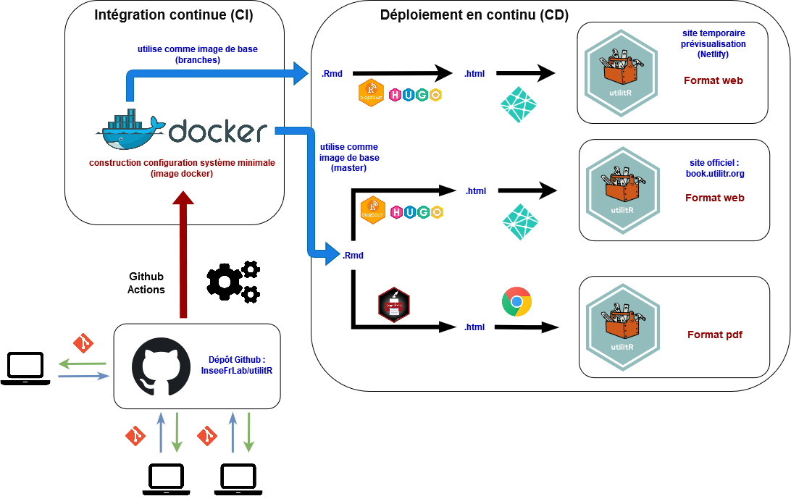

# Introduction

```{r setup, include=FALSE}
options(htmltools.dir.version = FALSE)
```

.sauterligne3[
Le projet `utilitR` vise à produire une documentation collaborative sur `R` et l'écosystème associé (RStudio, Git, Gitlab).
]

--

.sauterligne2[
Cette documentation est :

- un guide pratique, pas une introduction théorique à `R` ;
- principalement destinée aux agents du Service statistique public (mais pas uniquement);
- issue de la mise en commun des connaissances des agents du SSP sur `R` dans une approche collaborative, sur le modèle de Wikipedia.
]


```{r, echo = FALSE, warning = FALSE, eval = FALSE}
library(knitr)
library(kableExtra)
library(data.table)
description_appariement <- 
  as.data.table(
    data.frame(
      etape = c(
        rep('Utiliser `R` à l’Insee', 5),
        rep("Mener un projet statistique avec `R`", 5),
        rep("Importer des données", 3),
        rep("Manipuler des données", 3),
        rep("Produire des _outputs_", 3)
        ),
      filtres_validation = 
        c(
          "Les environnements de travail avec `R` à l'Insee : AUSv3 et SSP Cloud", 
          "Les environnements de travail avec `R` à l'Insee : AUSv3 et SSP Cloud", 
          "Configurer Git et Gitlab",
          "Personnaliser la configuration de `R`",
          "Gérer les ressources informatiques avec `R`",
          "Utiliser les projets RStudio",
          "Utiliser Git avec RStudio",
          "Installer des packages et gérer les dépendances",
          "Choisir des packages",
          "Demander de l'aide et se documenter",
          "Importer des données (SAS, csv, txt, odt, xlsx...)",
          "Utiliser une API",
          "Utiliser des bases de données",
          "Manipuler des données avec `data.table`",
    # + Manipuler des données (table des données, données textuelles, données spatiales) ;
    # + Utiliser des bases de données PostgreSQL et Oracle ;
    # + Faire des graphiques ;
    # + Rédiger des documents avec `R Markdown` ;
    # + Produire des rapports automatisés avec `R Markdown`.
          "BBB",
          "AAA",
          "BBB",
          "AAA",
          "BBB"
        )
    )
  )

kbl(description_appariement, align = "cll",
    col.names = c("Partie", 
                  "Fiches")
) %>%
  kable_styling(full_width = TRUE) %>%
  row_spec(0, align = 'c') %>%
  column_spec(1, bold = TRUE, width = "6cm") %>%
  column_spec(2, width = "12cm") %>% 
  collapse_rows(columns = 1, 
                valign = "middle", 
                longtable_clean_cut = TRUE)
```


---
# Introduction

.sauterligne2[
Le projet `utilitR` a pour objectif de produire une documentation qui réponde à deux questions, dans le contexte des travaux de la statistique publique :
]

- Comment (bien) travailler avec `R`, RStudio et les outils associés ;
  - Utiliser `R` à l'Insee ;
  - Mener un projet statistique avec `R` ;

--

- Comment réaliser efficacement des tâches standards avec `R` :
  - Importer des données avec `R` ;
  - Manipuler des données avec `R` ;
  - Produire des sorties avec `R`.


--

---
# Introduction

Historique du projet :

* Fin 2019 : premières évocations d'une documentation sur `R` ;
* Mars 2020 : lancement du projet ;
* Octobre 2020 : mise en ligne du site :
* Mai 2021 : finalisation des contenus ;
* 8-9 juin 2021 : lancement officiel d'`utilitR` ;

.gray[
* Septembre 2021 : diffusion de la documentation sous format pdf.
]

.sauterligne[
Plan de la présentation :
]

- `utilitR` depuis un an ;
- Spécificités du projet ;
- Fonctionnement du projet.


---
# `utilitR` depuis un an
## Depuis la présentation de l'an dernier

- Beaucoup de contenu supplémentaire ;
- Des contributeurs issus de plus d'institutions ;
- Aller plus loin dans le CI/CD ;
- Contributions bénéficiant à toute la communauté `r fontawesome::fa("fab fa-r-project")` ;
- Deux matinées `utilitR`:
    + 350 participants jour 1, 250 lors du jour 2 ;
    + 6 ateliers virtuels en parallèle sur le contenu de la documentation.

<br>__Merci aux contributeurs et aux parrains d'avoir soutenu la démarche__

---
# `utilitR` depuis un an
## Diffusion de la documentation

La documentation est diffusée sous trois formes :

- `r fontawesome::fa("fab fa-firefox")` un site internet ([www.utilitr.org](https://www.utilitr.org)) ;
    + Documentation principale sur [www.book.utilitr.org](www.book.utilitr.org) ;
    + Guide des bonnes pratiques en `R` sur [www.pratiques.utilitr.org](www.pratiques.utilitr.org) ;
- `r fontawesome::fa("fas fa-print")` chaque fiche est disponible en format A4 sur le site internet ;
- `r fontawesome::fa("fas fa-file-pdf")` l'intégralité de la documentation en format pdf. 

<br> Il est envisagé que le site internet soit actualisé en continu, tandis que la brochure pdf serait publiée de façon ponctuelle et millésimée. 

.sauterligne2[
La première brochure pdf millésimée _devrait_ sortir en septembre 2021. La possibilité d'une diffusion sous forme papier est à l'étude.
]


--

<br> **Participez à la diffusion en faisant connaître `utilitR` dans vos institutions**


---
# Spécificités du projet

.sauterligne2[
Le projet `utilitR` présente trois particularités :
]

- Une démarche collaborative et _open source_ ;
- Une publication entièrement reproductible ;
    + [](https://datalab.sspcloud.fr/launcher/inseefrlab-helm-charts-datascience/rstudio?onyxia.friendlyName=%C2%ABrstudio-utilitr%C2%BB&init.personnalInit=%C2%ABhttps%3A%2F%2Fraw.githubusercontent.com%2FInseeFrLab%2FutilitR%2Fmaster%2Fresources%2Finit_9juin.sh%C2%BB&r.version=%C2%ABinseefrlab%2Futilitr%3A0.7.0%C2%BB)
- Une documentation adaptée aux besoins des agents:
    + Exemples sur données [insee.fr](https://www.insee.fr) ;
    + Bonnes pratiques issues de l'expérience  ;
    + Rédaction par des utilisateurs de données.


---
# Spécificités du projet

## Une démarche collaborative et _open source_

* Projet entièrement _open source_ (`r fontawesome::fa("fab fa-github")` [`InseeFrLab`](https://github.com/InseeFrLab/utilitR)) ;
* Démarche collaborative impliquant 25 contributeurs :
    + dispersés dans toute la France ;
    + issus de plusieurs institutions du SSP (et même hors SSP).
* Organisation horizontale, sur le modèle de `Wikipedia` :
    + relecture par les pairs ;
    + validation collégiale ;
* Acculturation à des outils favorisant la *reproductibilité* et la *pérennité*, au-delà de l'usage de `r fontawesome::fa("fab fa-r-project")` :
    + `Docker` `r fontawesome::fa("fab fa-docker")` ;
    + `Git` `r fontawesome::fa("fab fa-git-alt")` ;
    + `Github` `r fontawesome::fa("fab fa-github")`.

**Le projet `utilitR` est un projet collaboratif et ouvert à tous, auquel tous les agents peuvent contribuer.**

---
# Spécificités du projet
## Un exemple de publication reproductible

* La documentation est rédigée entièrement avec `R` et les outils de l'écosystème `R Markdown` qui permettent de rassembler paragraphes textes et blocs de code en un seul code source ;
* Processus de publication à l'état de l'art :
    + Plusieurs _outputs_ (site web `r fontawesome::fa("fab fa-firefox")`, livre PDF `r fontawesome::fa("fas fa-file-pdf")`) avec les mêmes codes sources ;
    + Publication automatique à chaque modification des fichiers sources ;
    + La documentation est entièrement reproductible.

* Défis techniques surmontés ont permis des évolutions de l'écosystème `R Markdown` :
    + Solutions bénéficiant à l'ensemble de la communauté `r fontawesome::fa("fab fa-r-project")`.

--

.sauterligne[
**Le projet `utilitR` est un laboratoire qui préfigure les évolutions des méthodes de travail des statisticiens.**
]

---
# Spécificités du projet
## Une documentation adaptée aux besoins des agents

La documentation guide les agents dans leur usage de `R` :

- Elle décrit l'usage de `R` avec RStudio ;
- Elle formule des recommandations claires sur les outils et les _packages_ adaptés à chaque tâche ;
- Elle comporte des conseils et des remarques relatifs aux bonnes pratiques ;
- Elle est illustrée par des exemples reproductibles utilisant des données de l'Insee.

--

La documentation comprend quatre types d'informations isolées dans des encadrés colorés.

.sauterligne[
.small80[
```{r echo = FALSE, message = FALSE, eval = FALSE}
library(magrittr)
library(fontawesome)
texte_recommandation <- "Ce paragraphe présente succinctement les outils et les approches les plus adaptés à la tâche concernée. Chaque fiche ne comprend qu'un seul paragraphe de ce type, au début de la fiche."
texte_conseil        <- "Ce paragraphe détaille les bonnes pratiques à adopter."
texte_remarque       <- "Ce paragraphe donne des informations supplémentaires ou formule une mise en garde."
texte_specificite    <- "Ce paragraphe porte sur une spécificité de l'Insee qui a un impact sur l'usage de <code>R</code>."

symb <-
  c(fa("hand-point-right", fill = "rgba(220, 53, 69, 1)", height = "30px"),
    fa("lightbulb", fill = "rgba(255, 193, 7, 1)", height = "30px"),
    fa("info-circle", fill = "rgba(0, 123, 255, 1)", height = "30px"),
    fa("home", fill = "rgba(81, 81, 81, 1)", height = "30px"))

dt <- 
  as.data.frame(list(
    Nom = c("Recommandation", 
            "Conseil", 
            "Remarque",
            "Spécificité Insee"), 
    Symbole = symb,
    Signification = c(texte_recommandation, 
                      texte_conseil, 
                      texte_remarque,
                      texte_specificite)
  )
  )


output <- 
  dt %>% 
  knitr::kable(escape = F, position = "center", full_width = F, align="ccl") %>%
  kableExtra::column_spec(1, width = "3cm", bold = TRUE) %>%
  kableExtra::column_spec(2, width = "2cm") %>% 
  kableExtra::column_spec(3, width = "12cm") %>% 
  kableExtra::row_spec(0,bold=TRUE, align = "c")
output
```
]
]

---
# Spécificités du projet
## Des exemples reproductibles et proches des cas d'usage

La documentation comporte de nombreux exemples. Ces exemples ont trois particularités :

- Les exemples sont **reproductibles** : les agents peuvent reproduire la plupart des exemples de la documentation en en exécutant le code ;
- Les exemples sont **proches des cas d'usages de `R` dans le SSP** : les jeux de données utilisés dans les exemples sont issus de données disponibles sur [insee.fr](www.insee.fr) (code officiel géographique, base permanente des équipements, répertoire Filosofi) ;
- Les jeux d'exemple sont **disponibles dans tous les environnements de travail** (SSP Cloud, AUSv3, poste local). Ils sont mis à disposition dans le _package_ `doremifasolData` développé par des contributeurs du projet.


---
# Fonctionnement du projet
## Organisation du projet

**Le projet `utilitR` est un projet collaboratif, horizontal, _open source_ et ouvert à tous, auquel tous les agents peuvent contribuer.**

--
* Cinq principes détaillés dans le [manifeste](https://github.com/InseeFrLab/utilitR/blob/master/Manifeste.md) : transparence, ouverture, bienveillance, exigence et reproductibilité.

--

* Organisation sans hiérarchie :
    * Un _groupe de contributeurs_ `r emo::ji("black_nib")` (environ 25), parmi lesquels deux coordinateurs ;
    * Un _comité de parrainage_ composé de managers  `r emo::ji("angel")`: Benoît Rouppert, Arnaud Degorre, Patrick Sillard, Sébastien Roux.
--

* La marche à suivre pour contribuer est détaillée dans le [guide de contribution](https://github.com/InseeFrLab/utilitR/blob/master/CONTRIBUTING.md).

--
<br><br>
**Vous pouvez rejoindre l'équipe de contributeurs à tout moment.**


---
# Fonctionnement du projet
## Méthode de travail : une démarche collaborative et _open source_

Le projet `utilitR` est entièrement développé avec des outils collaboratifs :

- Les contributeurs collaborent par l'intermédiaire du dépôt `Github` du projet [www.github.com/inseefrlab/utilitr](https://www.github.com/inseefrlab/utilitr) ;
- Licence libre (Licence Ouverte 2.0) ;
- Les travaux sont menés selon les méthodes de développement logiciel (_pull requests_, _issues_) ;
- Toutes les contributions sont soumises à une relecture par les pairs et validées collégialement (sur le modèle de Wikipedia).

---
# Fonctionnement du projet
## Méthode de travail

Le projet `utilitR` utilise des méthodes d'intégration continue et de déploiement continu à l'état de l'art :

```{r, echo = FALSE, out.width="85%", fig.align="center"}

```


---
# Fonctionnement du projet
## L'intégration continue pour produire plus de contenu

```{r, eval = FALSE, echo = FALSE, out.width="50%", fig.show="hold"}
knitr::include_graphics("https://crowdspotsimages.s3-us-west-2.amazonaws.com/user-content/LcYPp_4UQjuu44T_RXp8qg.jpeg")
knitr::include_graphics("https://flexagon.com/wp-content/uploads/2020/04/a-world-without-ci.cd-meme.jpg")
```

<!---
Sources :
`https://crowdspotsimages.s3-us-west-2.amazonaws.com/user-content/LcYPp_4UQjuu44T_RXp8qg.jpeg`
`https://flexagon.com/wp-content/uploads/2020/04/a-world-without-ci.cd-meme.jpg`

---->

Chaque action sur `Github` déclenche des scripts pour construire, tester et déployer la mise à jour de la documentation:

+ **allège le travail** des coordinateurs et des contributeurs ;
+ assure un **environnement plus reproductible** ;
+ assure la **cohérence entre les différents formats** ;
+ **facilite le repérage des erreurs** ;
+ permet aux contributeurs d'ignorer les détails techniques de la production de la documentation et de **se concentrer uniquement sur le fond**.

```{r, echo = FALSE, out.width="50%", fig.show="hold", fig.align='center'}
knitr::include_graphics("https://flexagon.com/wp-content/uploads/2020/04/a-world-without-ci.cd-meme.jpg")
```

---
# Conclusion : retour d'expérience
## Avantages

* Traçabilité élevée des modifications ;
* Simplicité de mise à jour des outputs ;
* Ouverture des codes ;
* Collaboration renforcée ;
* Fiabilité du processus de publication ;
* Projet plus pérenne.

--

## Défis

* Capacité à se coordonner et à s'écouter ;
* Nécessité de hiérarchiser les objectifs ;
* Il faut apprendre à maîtriser les outils ;
* Il faut trouver du temps pour contribuer ;
* Importance d'avoir quelques contributeurs expérimentés.

---
# Conclusion : retour d'expérience
## Perspectives

* Participez à la diffusion d'`utilitR` !
    + Diffusez dans vos institutions [www.utilitr.org](https://www.utilitr.org)
    + On peut venir présenter `utilitR` dans vos institutions
* Participez au contenu d'`utilitR` !
    + Venez sur le dépôt [Github](https://www.github.com/InseeFrLab/utilitr.org) participer aux débats, proposer des modifications de la doc...
* Aidez à la mise en place de l'approche devOPS/dataOPS sur d'autres projets de la stat publique !
    + Convaincante pour les statisticiens qui s'acculturent
    + Projets plus fiables et pérennes

---
# Où en est le projet aujourd'hui ?

* Un portail d'accès sous forme de site *web* :
    + La documentation principale est disponible sur [www.book.utilitr.org](www.book.utilitr.org) ;
    + Guide des bonnes pratiques en `R` disponible sur [www.pratiques.utilitr.org](www.pratiques.utilitr.org).

* Un point d'entrée : <https://www.utilitr.org> ;
* Un mail de contact : utilitr-contact@insee.fr.


--

* Prochaines étapes :
    + Mai 2021 : finalisation des contenus ;
    + 8 juin 2021 : lancement officiel d'`utilitR` ;
    + Septembre 2021 : diffusion de la version 1 de la brochure pdf.

* `utilitR` d'ici un an:
    + Ajouter de nouveaux contenus ;
    + Mettre à jour certains contenus ;
    + Après `utilitR` `r fontawesome::fa("fab fa-r-project")`, `utilython` `r fontawesome::fa("fab fa-python")` ?


---
# Remerciements

<!-- Le projet `utilitR` est un projet collaboratif qui a bénéficié des contributions de :  -->
<!-- r paste0(paste(format(Filter(function(x) !("cph" %in% x$role), desc::desc_get_authors()), include = c("given", "family")), collapse = ", "), ".") -->

.small90[
.auteurs[

Contributeurs : Raphaële Adjerad, Mathias André, Pierre-Yves Berrard, Lionel Cacheux, Arthur Cazaubiel, Frédérique Cornuau, Sylvain Daubrée, Aurélien d'Isanto, Arlindo Dos Santos, Alexis Eidelman, Marie-Emmanuelle Faure, Gilles Fidani, Lino Galiana, Gaëlle Genin, Pierre Lamarche, Claire Legroux, Romain Lesur, Jean-Daniel Lomenède, Pascal Mercier, Olivier Meslin, Violaine Poirot, Géraldine Rochambeau, Clément Rousset, Milena Suarez Castillo, Cédric Tassart.

Coordination : Lino Galiana et Olivier Meslin.

Comité de parrainage : Arnaud Degorre, Benoît Rouppert, Patrick Sillard et Sébastien Roux.

Logo : Anna Schlaifer.

Les contributeurs remercient Julien Taquet et Marc Hufschmitt pour leur aide précieuse sur la mise en forme du site et de la brochure.
]
]

---
background-image: url('resources/logo-utilitr.png')
background-size: 7cm
background-position: 8.5cm 3cm

# Merci !


